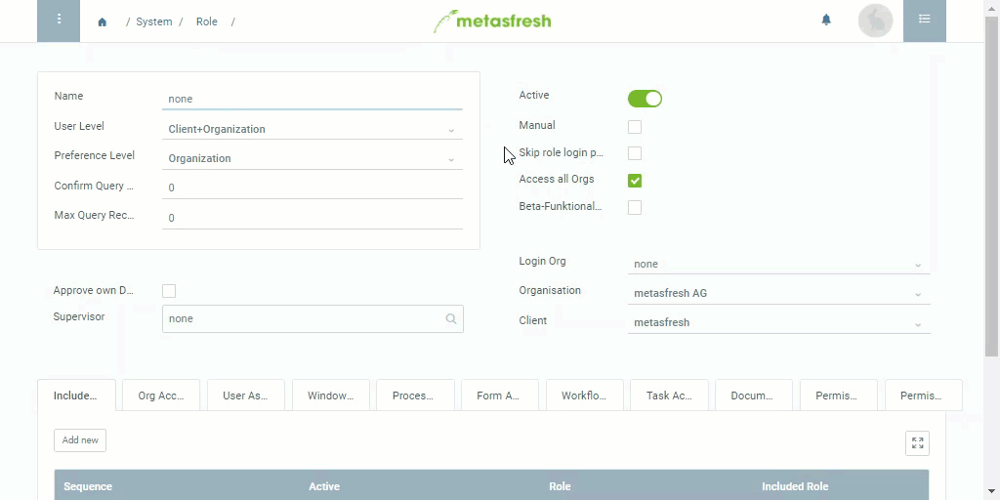

## Overview
A user role allows you to define which features the user can access and which data they can view.

## Steps
1. Open "Role" from the [menu](Menu).
1. [Create a new role](New_Record_Window).
1. **Name** the role, e.g. "Standard".

### Assign the role to a user
1. Go to the tab "User Assignment" at the bottom of the page.
1. [Add a new user](New_Record_Tab). A new window opens up.
1. In the field **[User](NewUser)/Contact** enter a part of the user name.
> Note 1: Hit `SPACE` to see all users.  
> Note 2: Select one of the shown options with the mouse or 

1. Click "Done" to close the window and add the user to the list.
1. [metasfresh saves the progress automatically](Saveindicator).

## Example

