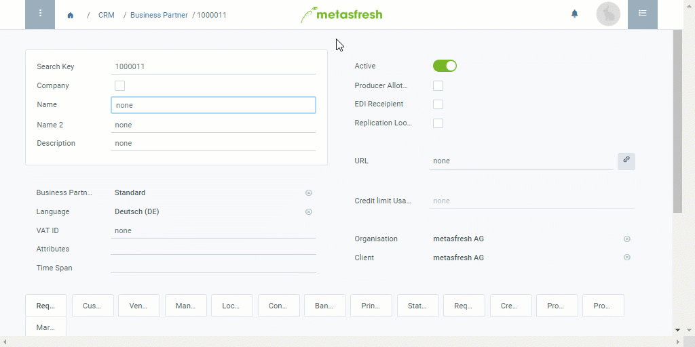

## Steps
1. Open "Business Partner" from the [menu](Menu).
1. [Add a new business partner](New_Record_Window).
1. The **Search Key** is an automatically assigned serial number. However, if required, it can also be assigned manually instead.
1. If the business partner is a company, tick the checkbox **Company** and fill in the field **Company Name**. Otherwise, uncheck the box and enter the partner's **Name**.
 >**Note:** The **(Company) Name** is restricted to 60 characters.

1. Select a [**Business Partner Group**](New_Business_Partner_Group), e.g., *Machine Supplier*.
1. Select the partner’s preferred **Language** for communication.
1. Add a **URL**, such as the partner's website.
 >**Note:** Make sure that the URL begins with the Internet protocol acronym (e.g., `https://`). Click on the link icon  on the right to open the web page.

1. [Add one or more addresses](Add_address_tab).
1. [metasfresh saves the progress automatically](Saveindicator).

### Optional Steps
1. [Add some appropriate **attributes**](Add_attributes_to_BP) that will help you find the business partner more quickly when using the [filtering function](Filtering_function).
1. Turn the business partner into a [customer](New_business_partner_customer) and/or [vendor](New_business_partner_vendor).
1. [Link the business partner to a pricing system](Assign_prices_to_partner).
1. Add contact information, i.e. [link the business partner to a user](Add_user_to_BPartner).
1. Record additional [tooltip information](BP_memo_tooltip) about the business partner.

## Example
<kbd></kbd>
