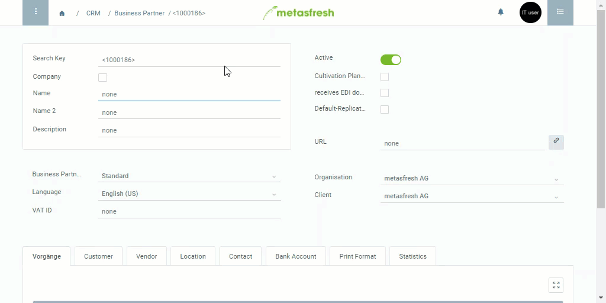

## Steps

### Create a Business Partner
1. Open "Business Partner" from the [menu](Menu).
1. [Create a new record](New_Record_Window).
1. The **Search Key** is an automatically assigned serial number. However, if required, it can also be assigned manually instead.
1. Fill in the field **Name**, or if the box **Company** is checked, fill in the field **Company Name**.
1. Select a **Business Partner Group**, e.g. “Client”.
1. Select the partner’s preferred language for communication.

### Add an address
1. Go to the record tab "Location" at the bottom of the page and click "Add new" to open the address window.
1. In the field **Name** enter the business partner's name.
1. To add an **Address**, click on the "Edit"-Button.
1. Enter the **Address**, **ZIP** code, **City** and **Country** of the company.
 >Note: If you choose "United States" as a country, you can also enter the **Region ID**. Simply close and re-open the address editing window by clicking the edit-button twice and the field will appear above **Country**.

1. Enter the company's **GLN** (Global Location Number), if available.
1. Click "Done" to close the window.
 >Note: You can add several addresses this way, if required.
 
1. [metasfresh saves the progress automatically](Saveindicator).

## Example

