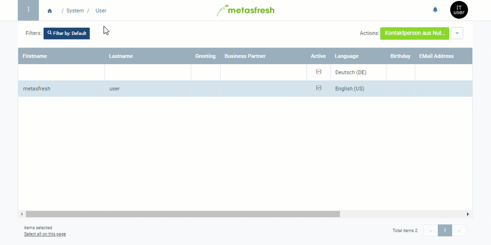

## Overview
System users are contacts (users) with access permissions to your system.

## Steps
1. Open the entry of an existing [user](Menu) or [add a new one](Add_user).

### Turn the contact into a system user
1. Check the box **System User** to grant user permissions to the contact.
1. In the field **Login** enter a username.
 >**Note 1:** The system user can log in using either the **Login** or the **Email Address** as username.  
 >**Note 2:** Please bear in mind that the username is ***case-sensitive***!

### Set a password
1. [Start the action](StartAction) "Change Password". An overlay window opens up.
1. Enter a **New Password** with at least 8 characters.
 >**Note 1:** An **Old Password** is not required if a new user is created.  
 >**Note 2:** Make sure the password consists of ***at least 8 characters*** or the entry ***will not be saved***!  
 >**Note 3:** Please bear in mind that the password is ***case-sensitive***!  
 >**Note 4:** Press and hold  to see the password.

1. Re-enter the password in the field **New Password (retype)**.
1. Click "Start" to accept the new password and close the overlay window.
1. [metasfresh saves the progress automatically](Saveindicator).

## Next Steps
- [Assign a role to the system user](Assign_user_role).
- ***Optional:*** [Assign a business partner to the user](Assign_BPartner_to_user).

## Example

