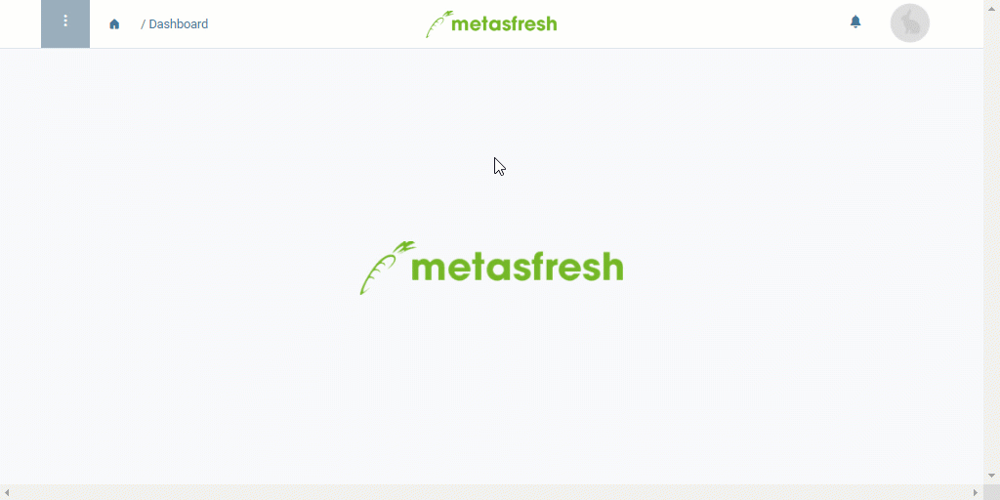

## Overview
metasfresh informs you about the status of your processes through short messages, so you are always up to date and able to react in time. You can easily choose how you want to be notified via the user menu. 
metasfresh offers the following types of notification:

| Notification Type | Meaning |
| :--- | :--- |
| Notify supervisor  ("*Betreuer benachrichtigen*") | A notification will be sent to the supervisor. |
| E-mail | A notification will be sent to the user via e-mail only. |
| Notice | A notification will be sent to the user's notifications inbox  only. |
| E-mail + Notice | Notifications will be sent both via e-mail as well as to the users notifications inbox . |
| None | No notifications will be sent. |

## Steps
1. Open the user menu  in the upper right corner of the menu bar.
 >**Note:** Use shortcut `Alt` + `4` / `⌥ alt` + `4`.

1. Click on "Settings".
1. On the lower left side of the window, select the preferred **Notification Type**, e.g., *Notice*.
1. [metasfresh saves the progress automatically](Saveindicator).

## Example

