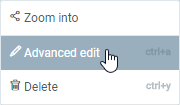
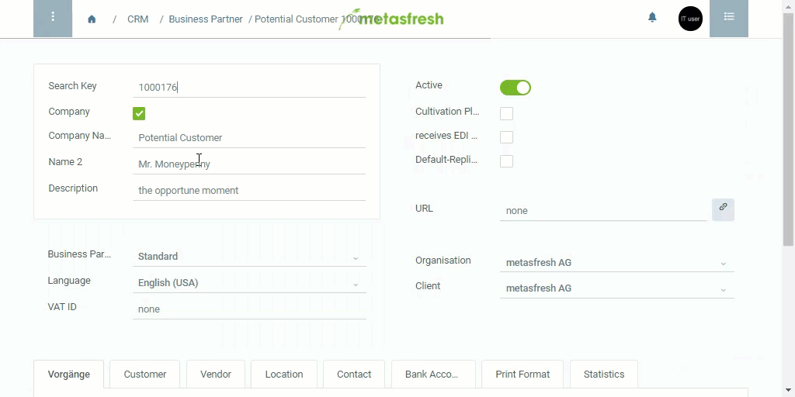

## Steps

1. Go to the tab in question, e.g. "Customer" under "Business Partner".
1. Hover with your mouse cursor over the line in question and right-click on it to open the context menu.
1. Click on "Advanced edit" to open the Advanced Edit Menu. 
 

## Example

