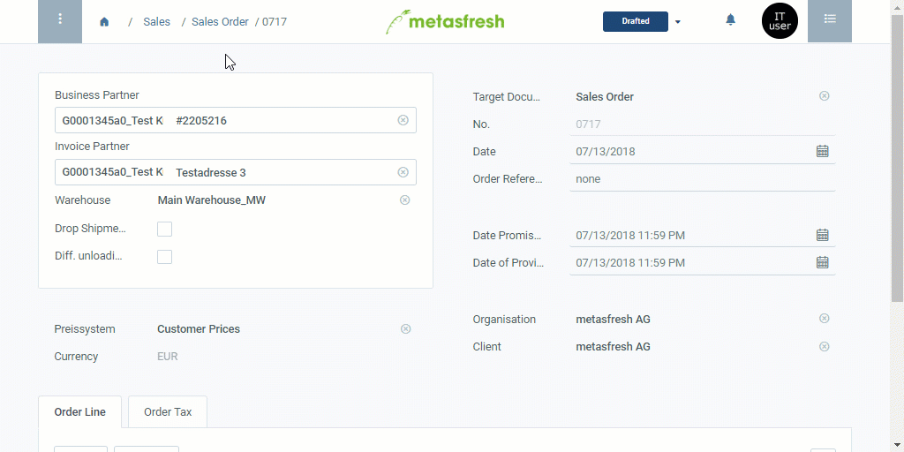

## Overview
An order line-specific product description can only be recorded in a sales order and will subsequently only appear on the corresponding sales order confirmation below the product name.

For additional information on how to place manual text on documents, please see [here](Print_text_on_documents-general).

## Steps
- Follow these [instructions for creating a sales order](SalesOrder_recording) up to **step 4 of the order line input**.

### Option 1: Direct way via the order line
1. Move the horizontal scrollbar of the order line table to the right until you reach the column **Description**.
1. Double-click the field **Description** of the order line for which you want to record a description and enter a text there.
1. Hit `↵ Enter` or click on a blank space anywhere in the sales order to apply.

### Option 2: Alternative way via the advanced edit menu
1. Open the [advanced edit menu](Open_AdvancedEditTab) of the order line for which you want to record a description.
1. Scroll down to the text box **Description** and enter your text here.
1. Click "Done" to apply the changes and close the advanced edit menu.

## Next Steps
- Follow the remaining steps for [creating a sales order](SalesOrder_recording) to complete the order.

## Example

