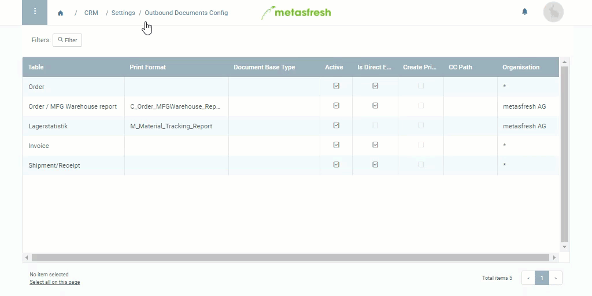

## Overview
You can set up the outbound documents for a variety of tables so the documents that are created, such as invoices, shipment notes, dunning letters, etc., get listed under "Outbound Documents" in the menu where you can then continue to process them either one by one or collectively.

## Steps
1. Open "Outbound Documents Config" from the [menu](Menu).
1. [Create a new configuration entry](New_Record_Window).
1. Start typing the name of the **Table** for which you want to configure the outbound documents and select the corresponding one from the suggestions, e.g. "Dunning".
1. Select a [**Print Format**](Add_print_format), e.g. *Mahnbrief (swat)*.
1. Make sure the box **In Direct Enqueue** is checked if you also want to send the completed documents to the print queue.
1. [metasfresh saves the progress automatically](Saveindicator).
  

| **Important Note:** |
| :- |
| For the configurations to take effect on the application server, it first has to be restarted by the admin. |

## Example

