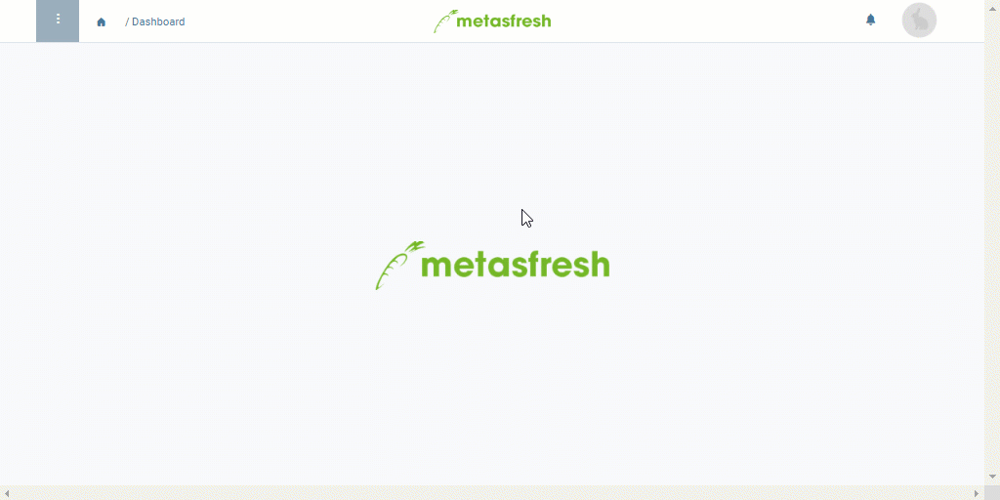

## Overview
In order to be able to [send documents via email from "Outbound Documents"](Send_email_from_outbound_docs), an email address has to be assigned to them. If you want to change the recipient which, for example, was added through [email server routing](Setup_email_server_routing), or choose an entirely different email address, please proceed as follows:

## Steps

### Open the entry
1. Open "Outbound Documents" from the [menu](Menu).
1. From the [list view](ViewModes), open the entry of the document whose recipient you want to change.

### a) Pick a different business partner contact
1. In the field **eMail Recipient**, enter a part of the [contact/user](New_business_partner_customer) name of the business partner and click on the matching result in the <a href="Keyboard_shortcuts_reference#dropdown" title="Dynamic Search Box (Autocompletion)">drop-down list</a>.
1. The field **eMail** is filled in automatically if an email address is provided.

### b) Enter a different email recipient
1. Delete the content of the fields **eMail Recipient** and **eMail**, if necessary.
1. Enter a different **eMail** address.
1. [metasfresh saves the progress automatically](Saveindicator).

## Next Steps
- [Send the email to the new recipient from "Outbound Documents"](Send_email_from_outbound_docs).

## Example

