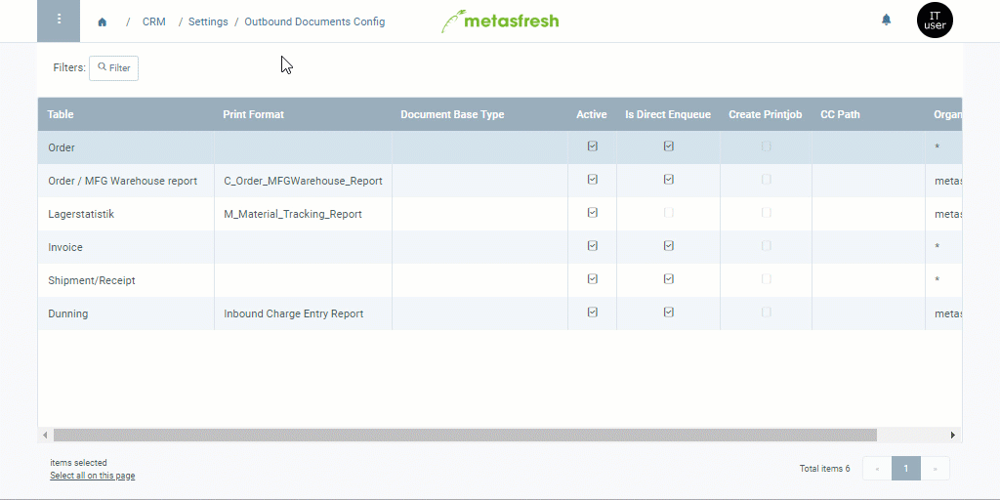

## Overview
You need to set up outbound documents for the serial letter feature so the created serial letters will be listed under "Outbound Documents" in the menu as well where you can then continue to process them either one by one or collectively.

## Steps
[Follow these instructions](Outbound_Documents_Config) and pick the **Table** *Letter* and the **Print Format** *Serial Letter*.
 >**Note:** Should the print format not be available, then [add a new one](Add_print_format) and use the **Table** *Letter* and the **Jasper Process** *Serial Letter*.

## Example

