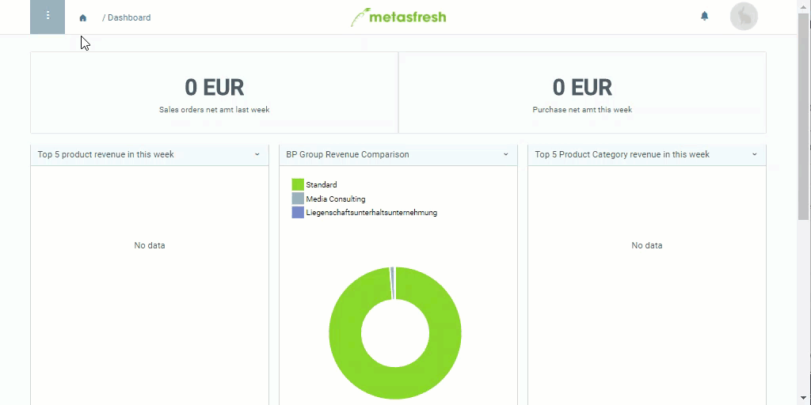

## Overview
When you subordinate a product category to another which is [linked to a compensation group schema](Compensation_group_schema_product_category), then the schema of the parent category will be applied during [group discounting](Order_line_group_discount) of [automatically created compensation groups](Create_automatic_compensation_groups). This way you can sort individual products into different categories and still give discounts on them as a group.

When [creating bills of materials from quotations](Create_BOM_upon_SO_generation), the parent category will be used to categorize the assembled sales product.

## Steps
1. Open "Product Category" from the [menu](Menu).
1. Open the entry of an existing product category or [create a new one](NewProductCategory).
1. Go to the field **Parent Product Category** and select the desired product category.
1. [metasfresh saves the progress automatically](Saveindicator).

## Example

