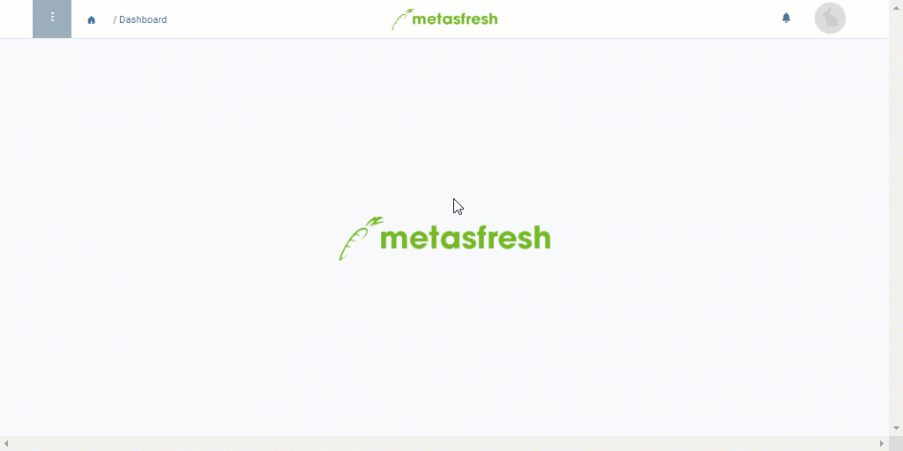

## Overview
When you have reached a contact from your phone call list and finished the call, you can [mark the contact as called](Phone_call_scheduling_call_made) in order to better keep track of which calls still need to be made.

You can also note down if a call results in a customer order and [jump directly from the phone call schedule into sales order recording](Phone_call_scheduling_sales_order).

By means of the [filtering function](Filtering_function) you can quickly gain an overview of the calls that have yet to be made.

## Requirements
- [Create an automatic phone call schedule](Create_automatic_phone_call_schedules).

## Steps

### Filter the phone call schedule
Open "Phone Call Schedule" from the [menu](Menu) and [use the filter](Filtering_function) to find specific entries in the phone call schedule more quickly. Besides the usual search items, you can also filter the schedules by:
- entries with and ***without*** sales orders, as well as by
- entries with called contacts and ***calls yet to be made***.

| Option | Checkbox |
| :--- | :---: |
| Click once on the checkbox to activate it and search for entries with created sales orders or called contacts. |  |
| Click on it a second time to search for entries ***without*** sales orders or with ***calls yet to be made***. |  |
| Click on `(clear)` on the right-hand side of the activated checkbox to deactivate it. |     |

## Example

