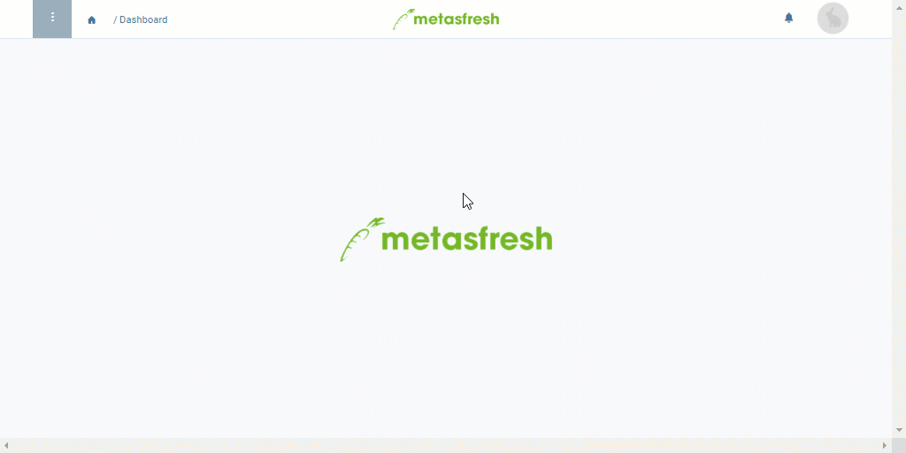

## Overview
When you have reached a contact from your phone call list and finished the call, you can [mark the contact as called](Phone_call_scheduling_call_made) in order to better keep track of which calls still need to be made.

You can also note down if a call results in a customer order and jump directly from the phone call schedule into sales order recording.

By means of the [filtering function](Phone_call_scheduling_filtering) you can quickly gain an overview of the calls that have yet to be made.

## Requirements
- [Create an automatic phone call schedule](Create_automatic_phone_call_schedules).

## Steps

### Create a sales order
1. Open "Phone Call Schedule" from the [menu](Menu).
1. From the [list view](ViewModes), [select](RecordSelection) the entry of the partner you have called and for whom you want to create a sales order.
1. [Start the quick action](StartAction) "Create Sales Order". A new sales order opens up in the same tab. It is already filled in with the business partner's information.
 >**Note:** You will also find this action in the actions menu in both the list view and the detailed view of an entry.

1. Continue with **step 4** of these [instructions for creating a sales order](SalesOrder_recording).

| Note: |
| :--- |
| As soon as you start the action "Create Sales Order" from the phone call schedule, the checkboxes **IsCalled** and **Verarbeitet** (*Processed*) of the respective entry are ticked automatically. |

## Example

