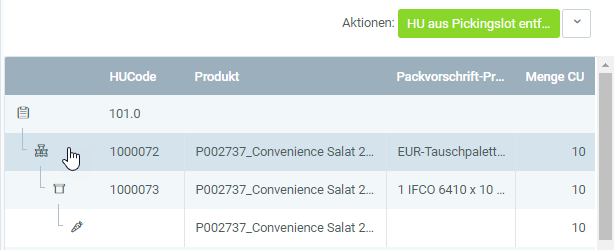

## Overview
In metasfresh, you can pick *handling units* ([HUs](Handling_Unit_System)) for shipments. The picked quantities are deducted from stock afterwards. 
You can check your stock inventory at any time in the "[Handling Unit Editor](Menu)".

## Requirements
- [Create a sales order](SalesOrder_recording) and [complete it](DocumentProcessingComplete).

## Steps
1. Open "Picking Terminal" from the [menu](Menu).
1. From the [list view](ViewModes), [select](RecordSelection) the product for which you want to pick an HU.
1. [Start the quick action](StartAction) "Pick". The picking window opens up.
1. In the left pane of the picking window, [select](RecordSelection) the sales order to be picked.
1. In the right pane, [select](RecordSelection) a picking slot, e.g., "101.0", and [start the quick action](StartAction) "Open HU selection window".
1. [Select](RecordSelection) an HU and [start the quick action](StartAction) "Pick HU". The HU will now be moved to the picking slot 101.0.
1. [Select](RecordSelection) the HU line and [start the quick action](StartAction) "Process picking". This makes the HU line read-only.
 >**Note:** The HU line must be selected for the quick action to become available.  
 

1. Click "Done" to close the picking window.

## Next Steps
- [Create a shipment with picked quantities](Ship_salesorder_picked_qty).

## Example

