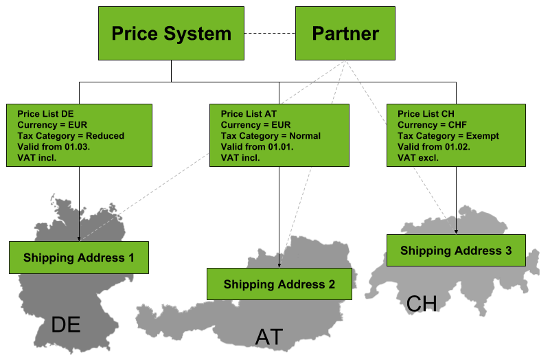

## Overview
The price system combines various price lists. These price lists can be country and currency-specific, so that they can be [assigned](Assign_prices_to_partner) to a particular partner (customer/vendor) or partner group.

