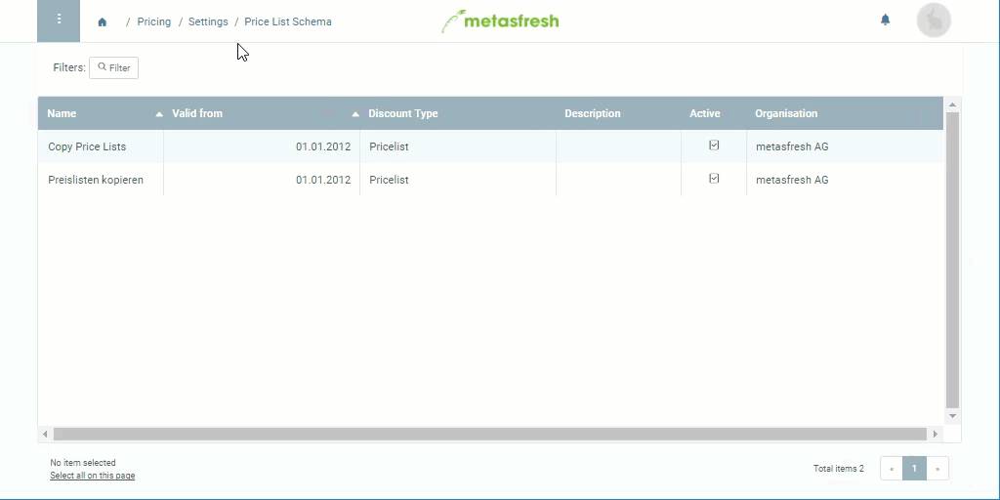

## Overview
For copying a price list you require a valid price list scheme where you can determine which products shall be copied, to which product category and/or business partner the scheme shall apply, and whether the standard prices shall be increased by a surcharge amount during copying.

## Steps
1. Open "Price List Schema" from the [menu](Menu).
1. [Create a new price list scheme](New_Record_Window).
1. Give the price list scheme a **Name**, e.g. "Copy Price List".
1. Set a **Valid from** date.
 >**Note:** If this date lies in the *past*, the price list scheme is effective *immediately*. If it lies in the *future*, the scheme will only apply *from that date*.

1. Select the **Discount Type** *Price List*.

### Add rules to the price list scheme
**Note:** In order for a price list to be copied, the selected price list scheme must include at least one schema line. However, it is not strictly necessary to define specific rules, such as a product, business partner or surcharge amount.

1. Go to the record tab "Schema Line" at the bottom of the page and click . A new window opens up.
1. Enter a **Standard Price Surcharge Amount** or leave it at *0.00*.
1. Click "Done" to close the window and add the rule to the list.

**Note:** The next time you are using this price list scheme when [copying a price list](Copy_prices_from_price-list-version), all affected products will receive the defined surcharge amount on their standard price.

## Example

