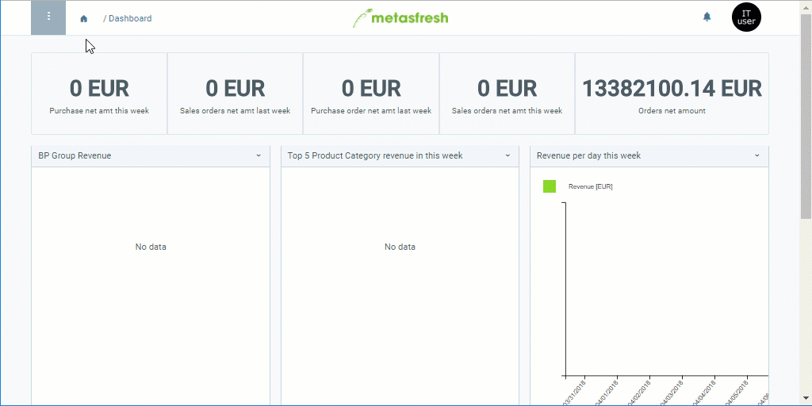

## Overview
In metasfresh you can record a manual text for every document type (e.g. bill of lading, incoming invoice, purchase order, sales order, quotation, etc.). Upon document creation, this text will then be automatically placed in the spaces provided on the document. It can be placed at the top as well as at the bottom of the document (see example [here](Print_text_on_documents-general)).

## Steps
1. Open "Document Type" from the [menu](Menu).
1. Open the entry of an existing document type, e.g. "Quotation (Angebot)".
1. In the text box **Description** enter a text that you want to appear at the top of the document.
1. In the text box **Document Note** enter a text that you want to appear at the bottom of the document.
1. [metasfresh saves the progress automatically](Saveindicator).

## Example

