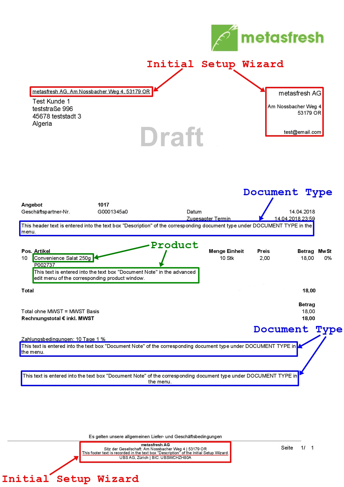

## Overview
In metasfresh you can add manual text to your documents and thereby modify them to meet the needs and requirements of your business.

For instance, you can put a description at the top of a quotation and leave a note for your customer at the bottom or you can add a text that describes the ordered product in more detail.

You can record these texts in metasfresh in a number of different ways. Upon document creation, the texts will then be automatically placed in the spaces provided on the document.

The following image of a quotation shows you the modifiable text passages and where to edit them in metasfresh:

---

## Initial Setup Wizard

#### Edit the return address and document footer
Click [here](InitialSetupWizard), if you want to edit these text passages with the initial setup wizard.

---

## Product

#### Partner-specific product management
Click [here](Partner-specific_products), if you want to record partner-specific product names and numbers that will appear on the documents of the respective business partners instead of the names and numbers you use for internal product management purposes.

#### Add a general product description
Click [here](Print_text_on_documents-product), if you want to add a general product description that will appear on all documents.

#### Add an order line-specific product description
Click [here](Order_line-specific_product_description), if you want to add a product description that will appear on the order confirmation only.

---

## Document type

#### Add a text at the top and the bottom of a document
Click [here](Print_text_on_documents-doctype), if you want to add a text at the top and bottom of a document.
