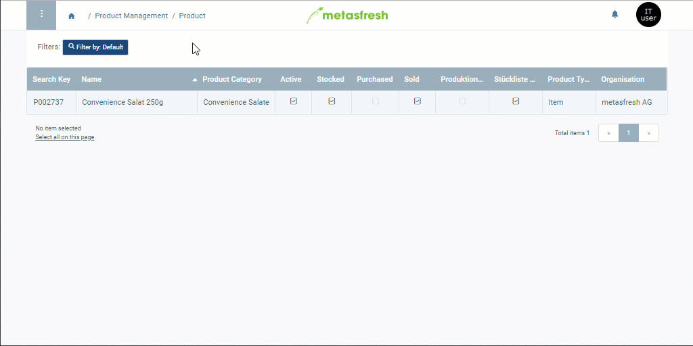

## Overview
The product description text will appear below the product name on all corresponding documents. For additional information on how to place manual text on documents, please see [here](Print_text_on_documents-general).

You can also autonomously transfer the product description into the languages of your business partners, so that when you [print commercial documents](PrintPreview) for foreign business partners, the text will automatically appear on these documents in their respective languages. For additional information on how to manage data entries in multiple languages, please see [here](Multilingual_data_management).

## Steps

### Add a Product Description
1. Open the entry of an existing [product](Menu) or [add a new one](NewProduct).
1. Open the [advanced edit menu](ViewModes#adv-edit) from the [actions menu](StartAction#actions-menu).
 >**Note:** Use shortcut `Alt` + `E` / `⌥ alt` + `E`.

1. Scroll down to the text box **Document Note** and enter your text here.
1. Click "Done" to apply the changes and close the advanced edit menu.
 >**Note:** You can quickly view product descriptions during batch entry in a sales order or purchase order by clicking on the tooltip icon  to the right of the product name in the order line.

### Translate a Product Description
1. Use the product entry's [related documents to jump](JumptoviaSidebar) into the window "Product Translation" (under PRODUCT MANAGEMENT in the sidebar).
1. In this window you will see all translation entries for the selected product entry.
1. Open the entry of the language in which you want to write the text, e.g., "Deutsch (DE)".
1. In the text box **Note**, enter the foreign language text version of the product description.
1. Tick the checkbox **Translated** if this has not yet been done.
1. [metasfresh saves the progress automatically](Saveindicator).

## Example

