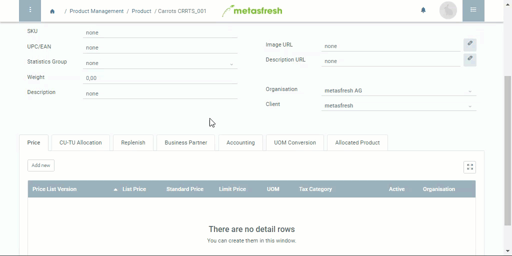

## Steps
1. Open an [existing product](NewProduct).
1. Go to the record tab "Price" at the bottom of the page and click . A new window opens up.
1. Enter the name of the designated **Price List Version**, e.g. "New Price List Germany".
 >**Note:** Hit `SPACE` to see all available price lists.

1. The field **Standard Price** determines the effectively valid purchase or sales price (depending on the respective price list).
1. The field **UOM** determines the sales UOM and ***must not be confused*** with the product's stock UOM (inventory management)!
 >**Note:** If sales UOM ≠ stock UOM, you have to define a [UOM conversion](Convert_UOMs).

1. In the field **Tax Category** you can select the respective value-added tax (VAT) category, such as *normal*, *reduced*, *tax-free*.
1. Click "Done" to close the window and add the price list version to the list.

## Example

## Further Relevant Fields
1. The field **List Price** determines the list price that will later appear on the documents.
1. **Limit Price**: Manual price changes made by the user, e.g. in the order line, must not fall below this amount!
1. The field **UOM** determines the unit of measurement for which the price applies (sales UOM) and must not be confused with the product's UOM used for inventory management (stock UOM)!
