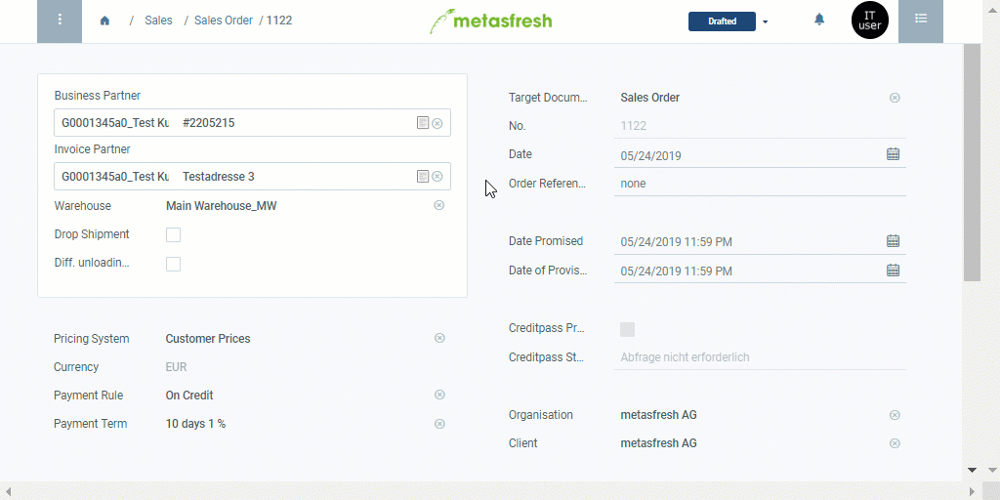

## Overview
You can open the product proposals list under [sales orders](SalesOrder_recording), [purchase orders](CreatePurchaseOrder) and [business partners](New_Business_Partner) in the menu. It enables you to compare product prices for various business partners as well as to edit prices and price lists without taking the long way via the menu.

## Steps

### Edit prices and update price list
1. [Open the product proposals list](Product_proposals_open_list).
1. From the product proposals, pick out the product whose price you want to edit.
1. Double-click the field **Price** of the product line and enter a new value there. Hit `↵ Enter` to apply.
 >**Note:** Repeat the steps 2 to 3 for further products whose prices you want to change.

1. [Select](RecordSelection) the lines of the products whose prices you have edited.
1. [Start the quick action](StartAction) "Save to price list". The prices have now been updated on the respective price list.

### Save and continue
1. Click "Done" to apply the changes and close the product proposals list.
1. Continue with the remaining steps of creating a [sales order](SalesOrder_recording) or [purchase order](CreatePurchaseOrder), if necessary.

## Next Steps (optional)
- [Use the product proposals list when entering a sales/purchase order](Product_proposals_sales_purchase_order).
- [Add products to a price list via product proposals](Product_proposals_add_products).
- [Remove products from a price list via product proposals](Product_proposals_remove_products).
- [Use the product proposals list to see and compare the product prices for various business partners](Product_proposals_compare_prices).

## Example

