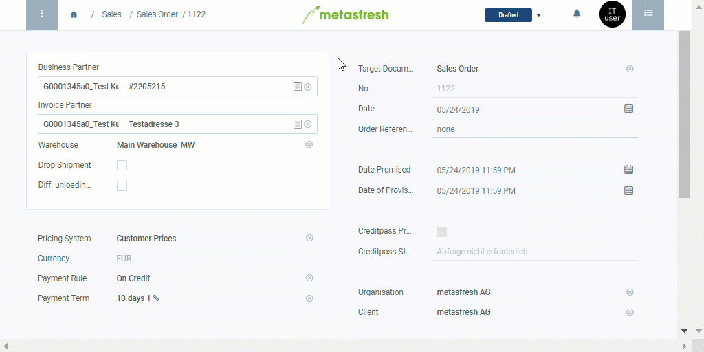

## Overview
The product proposals list serves to gain an overview of all products on a currently valid price list. Likewise it can be used to quickly and easily compare the prices at which a specific product from the price list is traded with other business partners. Moreover, it is possible to add new products to or remove deprecated ones from a price list, even while entering a sales order or purchase order.

You can open the product proposals list under [sales orders](SalesOrder_recording), [purchase orders](CreatePurchaseOrder) and [business partners](New_Business_Partner) in the menu. To do so, please proceed as follows:

## Steps

### In sales orders
1. Follow these [instructions for creating a sales order](SalesOrder_recording) up to the **order line input**.
1. Go to the record tab "Order Line" at the bottom of the page and click  to open the product proposals list.
 >**Note:** Use shortcut `Alt` + `Z` / `⌥ alt` + `Z`.

### In purchase orders
1. Follow these [instructions for creating a purchase order](CreatePurchaseOrder) up to the **order line input**.
1. Go to the record tab "PO Line" at the bottom of the page and click  to open the product proposals list.
 >**Note:** Use shortcut `Alt` + `Z` / `⌥ alt` + `Z`.

### In business partner entries
1. Open the entry of an existing [business partner](Menu) in the [detailed view](ViewModes) or [add a new one](New_Business_Partner).
1. [Start the action](StartAction) "Product Proposals". An overlay window opens up with the product proposals list.

## Next Steps
- [Use the product proposals list when entering a sales/purchase order](Product_proposals_sales_purchase_order).
- [Use the product proposals list to edit product prices and price lists directly from a sales/purchase order](Product_proposals_edit_prices).
- [Add products to a price list via product proposals](Product_proposals_add_products).
- [Remove products from a price list via product proposals](Product_proposals_remove_products).
- [Use the product proposals list to see and compare the product prices for various business partners](Product_proposals_compare_prices).

## Example

