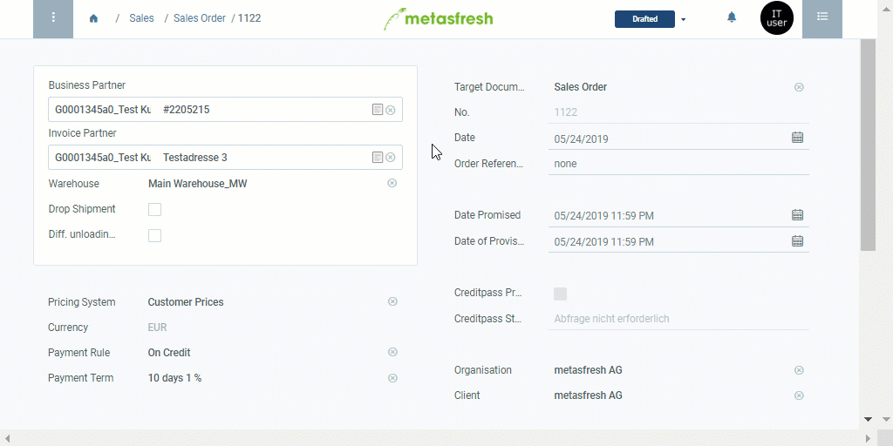

## Overview
You can open the product proposals list under [sales orders](SalesOrder_recording), [purchase orders](CreatePurchaseOrder) and [business partners](New_Business_Partner) in the menu. It enables you to compare product prices for various business partners as well as to edit prices and price lists without taking the long way via the menu.

## Steps

### Remove products from price list (*only in sales orders and purchase orders*)
1. [Open the product proposals list](Product_proposals_open_list).
1. [Select](RecordSelection) the lines of the products you want to remove from the current price list.
1. [Start the quick action](StartAction) "Remove".
1. An overlay window opens up asking you whether you really want to delete the line.
1. Click "Start" to confirm and remove the products from the price list.

### Save and continue
1. Click "Done" to apply the changes and close the product proposals list.
1. Continue with the remaining steps of creating a [sales order](SalesOrder_recording) or [purchase order](CreatePurchaseOrder), if necessary.

## Next Steps (optional)
- [Use the product proposals list when entering a sales/purchase order](Product_proposals_sales_purchase_order).
- [Use the product proposals list to edit product prices and price lists directly from a sales/purchase order](Product_proposals_edit_prices).
- [Add products to a price list via product proposals](Product_proposals_add_products).
- [Use the product proposals list to see and compare the product prices for various business partners](Product_proposals_compare_prices).

## Example

