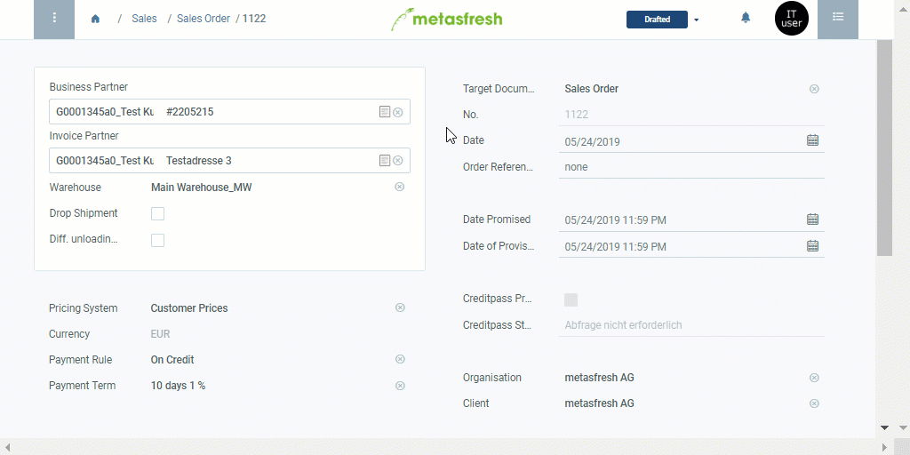

## Overview
The product proposals list serves to gain an overview of all products on a currently valid price list. Likewise it can be used to quickly and easily compare the prices at which a specific product from the price list is traded with other business partners. Moreover, it is possible to add new products to or remove deprecated ones from a price list, even while entering a sales order or purchase order.

In order to use the product proposals list to enter a sales order or purchase order, please proceed as follows:

## Steps

### Enter a sales order
1. [Open the product proposals list in a sales order](Product_proposals_open_list).
1. Pick out the product of your choice from the product proposals and enter a quantity into the field in the column **Quantity**.  Hit `↵ Enter` to apply.
 >**Note:** Repeat this procedure for further products you want to add to the sales order.

1. ***Optional:*** Adjust the product price by double-clicking the field in the column **Price** and entering a different value.  Hit `↵ Enter` to apply.
1. Click "Done" to close the product proposals list and add the selected products with the entered quantity to the order lines.
1. Continue with the remaining steps of [creating a sales order](SalesOrder_recording).

### Enter a purchase order
1. [Open the product proposals list in a purchase order](Product_proposals_open_list).
1. Pick out the product of your choice from the product proposals and enter a quantity into the field in the column **Quantity**.  Hit `↵ Enter` to apply.
 >**Note:** Repeat this procedure for further products you want to add to the purchase order.

1. ***Optional:*** Adjust the product price by double-clicking the field in the column **Price** and entering a different value.  Hit `↵ Enter` to apply.
1. Click "Done" to close the product proposals list and add the selected products with the entered quantity to the order lines.
1. Continue with the remaining steps of [creating a purchase order](CreatePurchaseOrder).

## Next Steps (optional)
- [Use the product proposals list to edit product prices and price lists directly from a sales/purchase order](Product_proposals_edit_prices).
- [Add products to a price list via product proposals](Product_proposals_add_products).
- [Remove products from a price list via product proposals](Product_proposals_remove_products).
- [Use the product proposals list to see and compare the product prices for various business partners](Product_proposals_compare_prices).

## Example

