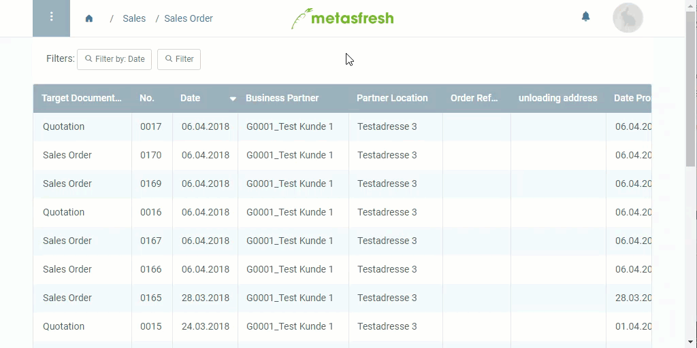

## Steps

1. Open a completed [Quotation](Create_SalesQuotation).
1. [Start the action](StartAction) "Create Sales Order from this Quotation". A new window opens up.
1. Set the field **Document Type** to *Sales Order*.
1. Click "Start" to confirm and close the window.

## Example

