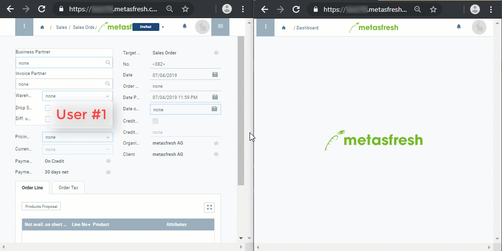

## Overview
In addition to [unique window URLs](Unique_window_URLs), metasfresh also allows two or more users with the same hyperlink to simultaneously work in the same window and follow each other's input in real time. In this way, metasfresh enables global, simultaneous team collaboration, ensuring that everyone can view the same data and that no unwanted duplicates are created.

### Real-time window update
<kbd></kbd>
