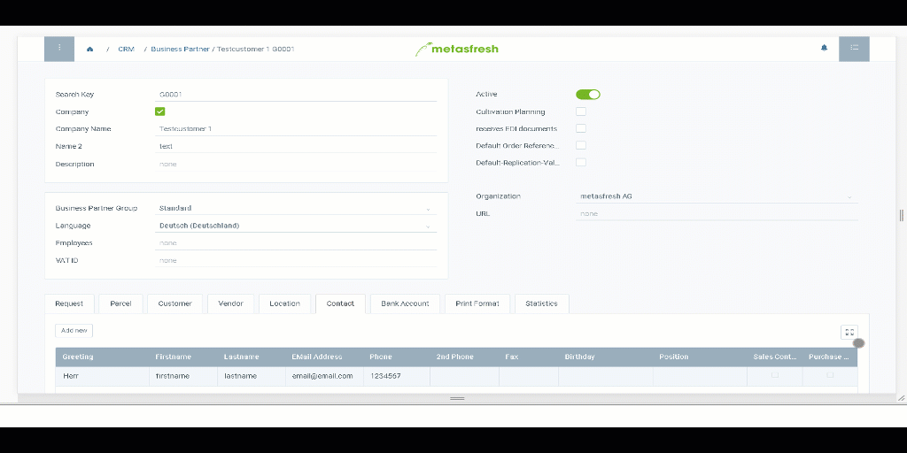

## Overview

metasfresh runs on any device from Desktop PCs to smartphones and adapts to the respective screen available.

Why is that a good thing?

You can use the app even when you are not at the office but with your customer or at the trade fair. Your business processes and data are always at your fingertips.

See here how the interface adapts to different devices:

