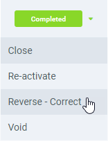

## Requirements
- [Receive inbound empties](Record_empties_receipt).

## Steps
1. Open "Empties Receive" from the [menu](Menu).
1. From the [list view](ViewModes), open the entry of the empties receipt you want to reverse.
1. Open the [document processing menu](StartAction) (`Alt` + `I` / `⌥ alt` + `I`) and click on *Reverse - Correct*. 

1. The empties receipt has now been reversed. In its **Description** text box you will find the number of the reversal document which in turn contains the number of the reversed empties receipt as **Description**. In addition, all reversed empties are listed here with their signs reversed.

| **Note:** |
| :--- |
| You will find the newly created reversal document by reference to the document number under "[Empties Receive](Menu)" in the menu. |

## Example

