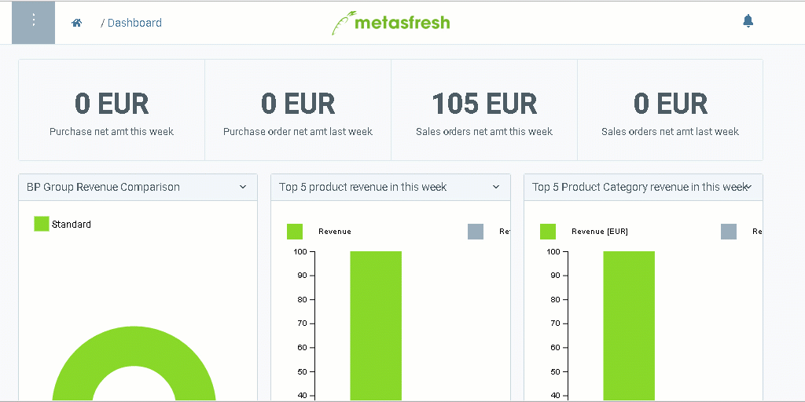

## Steps

1. Open "Sales Order" from the [menu](Menu).
1. [Create a new sales order](New_Record_Window).
1. In the field **Business Partner** enter a part of the customer name or number.
 > Note 1: Hit `SPACE` to see all customers.  
 > Note 2: Select one of the shown options with the mouse or 

1. [metasfresh saves the progress automatically](Saveindicator).

### Add new lines
1. Go to the tab "Order Line" at the bottom of the page and click "Batch Entry" to open the fast order line input.
 > Note: Use shortcut `Ctrl + Q`

1. In the field **Product**, enter a part of the product name or number and click on one of the results.
 > Note 1: Hit `SPACE` to see all products.  
 > Note 2: Select one of the shown options with the mouse or 

1. Enter a **Quantity**.
 > Note: Use the mouse or `TAB` key to go to the field

1. Hit `ENTER` to add the line to the order.
 > Note: Repeat steps 2 to 4 until you have registered all order items.

### Complete order

1. [Complete the order](DocumentProcessingComplete).
1. [Open the PDF preview](PrintPreview).

## Example

