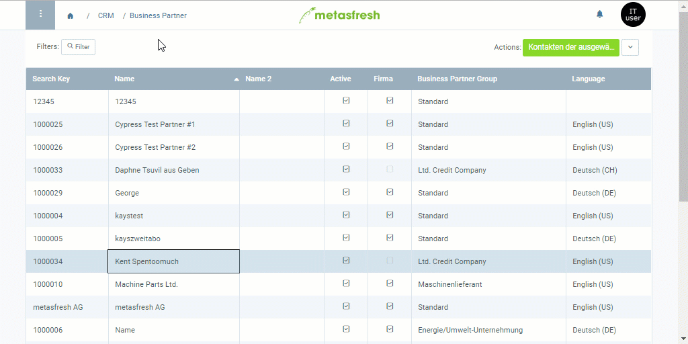
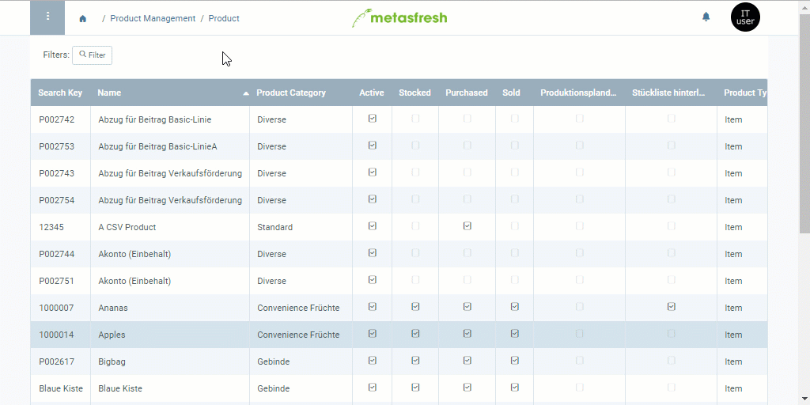

## Overview
In metasfresh, you can sell or purchase all products on a price list to or from all the business partners, respectively, that are linked to this very same price list. But what if you only want to make a specific selection of products available to individual partners without having to create a new price list for each one of them, which as such would be identical to the original one except for the excluded products and otherwise would only result in duplicated data and additional organizational overhead?

In this case, you can simply create partner-related exclusion lists with those products you want to block for sales or purchasing. This will subsequently prevent you from adding the blocked products to any sales or purchase orders. You can create these lists in the product entry as well as in the business partner entry. To do so, take the following steps:

## Steps

### Via Business Partner
1. Open the entry of an existing [business partner](Menu) or [add a new one](New_Business_Partner).
1. Go to the record tab "Product" at the bottom of the page and click . An overlay window opens up.
1. Enter the **Product** you want to block for sales/purchasing.
1. In the text box **Exclusion From Sale Reason**, enter a reason why the product is blocked for the business partner.
 >**Note:** This reason will be displayed in an error message to the user when they want to add the blocked product to a sales or purchase order.

1. Check the box **Exclusion from sales documents**.
 >**Note:** This setting affects ***both sales and purchase orders***, depending on whether the business partner is a [customer](New_business_partner_customer) or [vendor](New_business_partner_vendor).

1. Click "Done" to close the overlay window and add the blocked product to the list.
 >**Note:** Repeat steps 2 to 6 to add further sales/purchasing blocks for more products to the list.

### Example

---

### Via Product
1. Open the entry of an existing [product](Menu) or [add a new one](NewProduct).
1. Go to the record tab "Business Partner" at the bottom of the page and click . An overlay window opens up.
1. Enter the name of the **Business Partner** for whom you want to block the product.
 >**Note 1:** Business partners can be customers and vendors.  
 >**Note 2:** Hit `SPACE` to see all available [business partners](New_Business_Partner).  
 >**Note 3:** Select one of the shown options with the mouse or .

1. Scroll down to the field **Exclusion from sales documents** and check the box. A new text box **Exclusion From Sale Reason** appears.
 >**Note:** This setting affects ***both sales and purchase orders***, depending on whether the business partner is a [customer](New_business_partner_customer) or [vendor](New_business_partner_vendor).

1. In the text box **Exclusion From Sale Reason**, enter a reason why the product is blocked for the business partner.
 >**Note:** This reason will be displayed in an error message to the user when they want to add the blocked product to a sales or purchase order.

1. Click "Done" to close the overlay window and add the sales/purchasing block to the list.
 >**Note:** Repeat steps 2 to 6 to add further sales/purchasing blocks for further business partners to the list.

### Example

