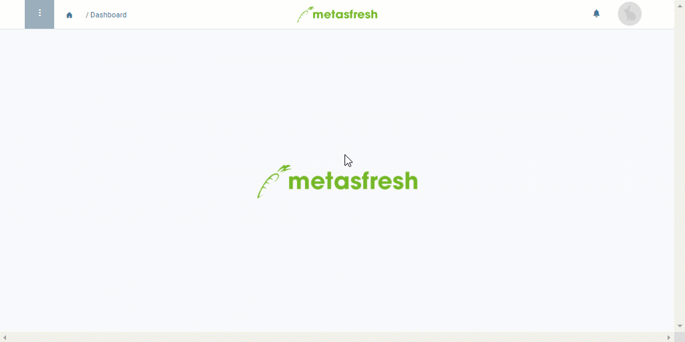

## Overview
Under "Outbound Documents" in the menu you will find all documents along with their related documents which you have previously created at their respective places, such as [sales order confirmations](SalesOrder_recording), [delivery notes](Ship_SalesOrder), [invoices](Invoice_SalesOrder), etc. When using [email server routing](Setup_email_server_routing), the email addresses of the corresponding [contacts/users](Add_user_to_BPartner) may have already been added to all these documents automatically and they are now ready to send.

In order to send multiple mailable documents via email, please proceed as follows:

## Requirements
1. [Set up a mailbox for outbound documents](Outbound_documents_setup_email_server).
1. [Set up email server routing for outbound documents](Setup_email_server_routing).

## Steps
1. Open "Outbound Documents" from the [menu](Menu).
1. From the [list view](ViewModes), [select](RecordSelection) the documents you want to send via email.
 >**Note:** Make sure that [each document has an email address](Outbound_docs_change_recipient_email) assigned (see field in column **eMail**).

1. [Start the action](StartAction) "Auswahl als Email an Geschäftspartner senden" (*Send selection via email to business partner*). An overlay window opens up.
 >**Note:** You will also find this action in the actions menu in the detailed view of an entry.

1. Click "Start" to email the documents and close the overlay window.
1. Once the documents have been successfully emailed, the respective fields in the column **Last eMailed** are updated with the actual time of transmission. This may take a couple of seconds.
1. If a document was emailed successfully, you can go to the record tab "Log" of the respective entry under "Outbound Documents" where you will find a line with the **Status** *Mitteilung versendet* (= message sent).

## Next Steps (optional)
- [Manually change the email recipient of outbound documents under "Outbound Documents"](Outbound_docs_change_recipient_email).

## Example

