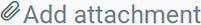
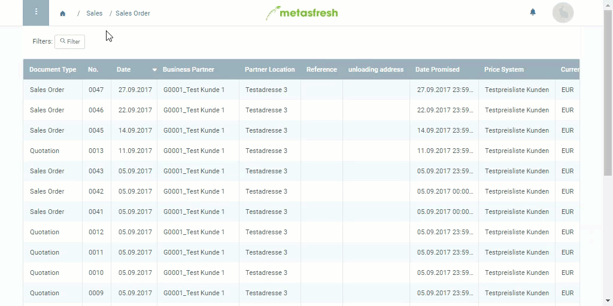

## Overview
In metasfresh, you can send an e-mail directly from the system to any partner you are communicating with (e.g., in sales orders or purchase orders).

## Steps
1. Open an entry, e.g., a [sales order](SalesOrder_recording).
1. Open the [actions menu](StartAction)  and click on "E-mail". The e-mail editor opens up.
 >**Note 1:** Alternatively, press `Alt` + `K` / `⌥ alt` + `K` to open the e-mail editor.  
 >**Note 2:** The name of the recipient, if available, will be filled in automatically.

1. Compose your own text or select a template from the template field at the top right of the e-mail editor.
 >**Note:** The template field will appear only if at least one template has been recorded under "[Boilerplate](Create_boiler_plate)" in the menu.

1. The referenced document (e.g., the sales order) will be automatically attached to the e-mail. You can add additional documents by clicking on  at the bottom left of the e-mail editor.
1. Click  to send the e-mail.

## Example

