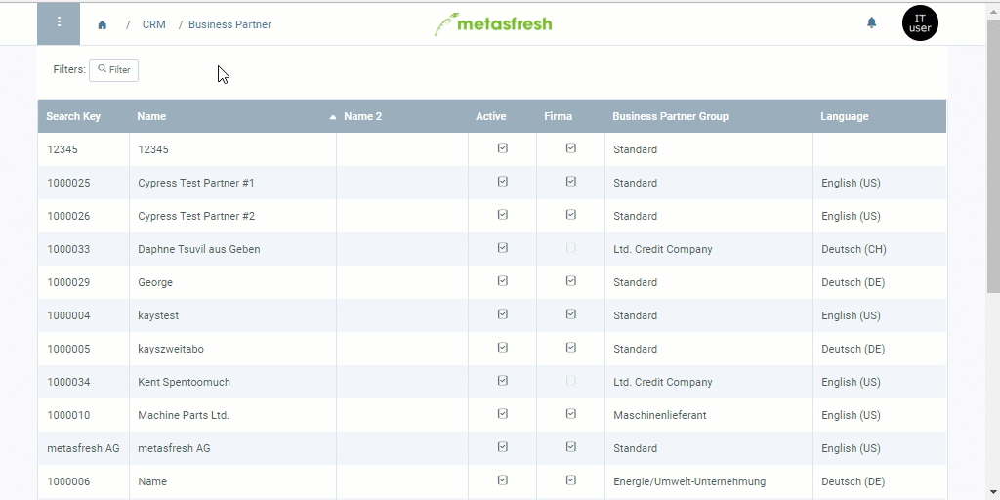

## Overview
With the credit limit you can determine a maximum amount up to which your business partners are allowed to collect unpaid invoices. If a partner has reached this amount, any new orders placed by them cannot be processed for as long as their debts remain unpaid.

## Steps
1. Open the entry of an existing [business partner](Menu) or [add a new one](New_Business_Partner).
1. Go to the record tab "Credit Limit" at the bottom of the page and click . A new window opens up.
1. Select a **Credit Limit Type**, e.g. *Management*.
1. Enter an **Amount** which a business partner is maximally allowed to reach with unpaid invoices until they are blocked from placing further orders.
1. Set a **Date from**.
 >**Note:** If this date lies in the *past*, the credit limit is effective *immediately*. If it lies in the *future*, it will only apply *from that date*.

1. Click "Done" to close the window and add the credit limit to the list.
 >**Note:** The credit limit will take effect only after [approval by an authorized user](Credit_limit_approval).

## Next Steps
1. [Request approval for the credit limit](Credit_limit_request_approval).
1. [Approve credit limit (only authorized users)](Credit_limit_approval).

## Example

