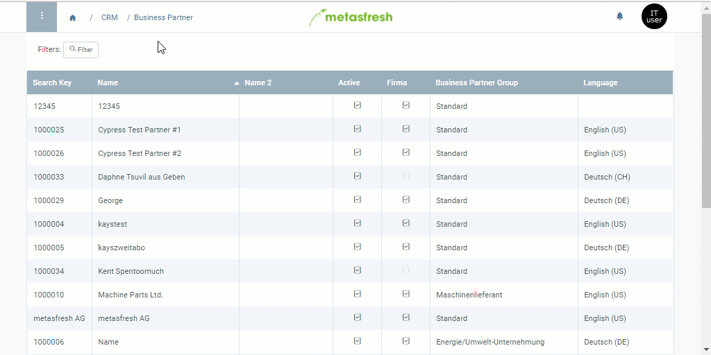

## Overview
This describes how you can manage the [credit status](Credit_status_types) of a single business partner. If you want to know how to set the credit status for an entire business partner group, click [here](Set_credit_status_BPgroup).

## Steps
1. Open the entry of an existing [business partner](Menu) or [add a new one](New_Business_Partner).
1. Go to the record tab "Statistics" at the bottom of the page.
1. Double-click the field **Credit Status** of the statistics line and pick a status from the drop-down list, e.g., *Credit OK*.
1. [metasfresh saves the progress automatically](Saveindicator).

## Next Steps
1. [Set credit limit](Set_credit_limit).
1. [Request approval for the credit limit](Credit_limit_request_approval).
1. [Approve credit limit (only authorized users)](Credit_limit_approval).

## Example

