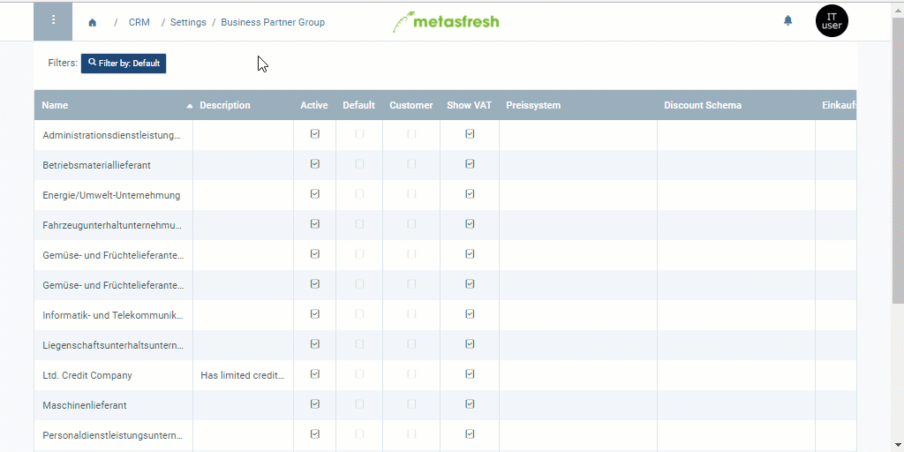

## Overview
If you set a [credit status](Credit_status_types) for an entire business partner group, this status will apply to any business partner that is linked to this group upon [creation](New_Business_Partner).

If you want to know how to subsequently manage the credit status of a business partner individually, click [here](Set_credit_status_BP).

## Steps

### Set credit status
1. Open the entry of an existing [business partner group](Menu) or [add a new one](New_Business_Partner_Group).
1. Go to the field **Credit Status** and select a status, e.g. *Credit OK*.
 >**Note:** This credit status will only be applied to those entries of business partners which are linked to this business partner group after completing these settings. The credit statuses of all existing partners already linked to this business partner group remain unchanged.

1. [metasfresh saves the progress automatically](Saveindicator).

### Link credit status to business partner
1. Open the entry of an existing [business partner](Menu) or [add a new one](New_Business_Partner).
1. Go to the field **Business Partner Group** and select the group previously configured with this credit status.
1. Go to the record tab "Statistics" at the bottom of the page. Here you can check the credit status in the column of the same name and [manage it individually](Set_credit_status_BP).

## Next Steps
1. [Set credit limit](Set_credit_limit).
1. [Request approval for the credit limit](Credit_limit_request_approval).
1. [Approve credit limit (only authorized users)](Credit_limit_approval).

## Example

