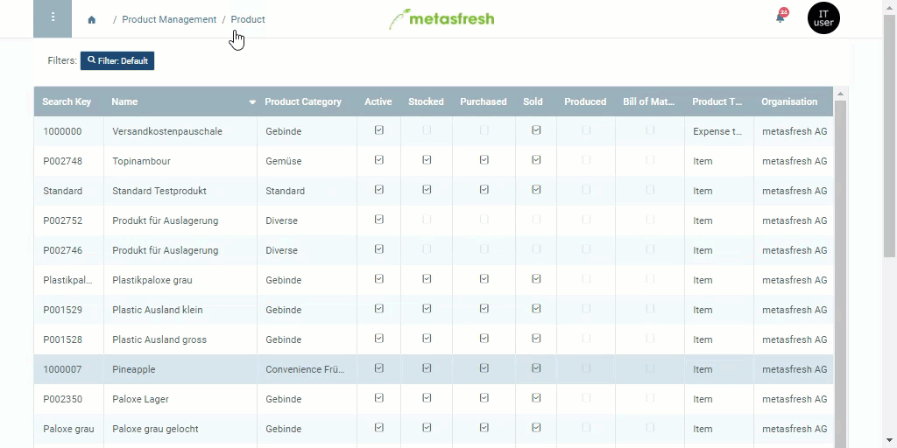

## Requirements
- [Link the product to a vendor](Link_product_to_business_partner).

## Steps
1. Open the entry of an existing [product](Menu) or [add a new one](NewProduct).
1. Go to the record tab "Business Partner" at the bottom of the page.
1. Open the [advanced edit menu](Open_AdvancedEditTab) of the linked [vendor](New_business_partner_vendor).
1. Tick the checkbox **Current vendor**.
1. Click "Done" to apply the changes and close the advanced edit menu.

## Next Steps (optional)
- [Generate a sales order-related purchase order](Generate_SO-related_PO).
- [Configure planning data for purchasing a product (automatic purchase requisitions)](Product_planning).

## Example

