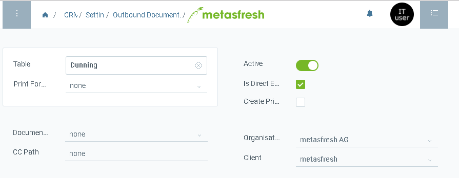
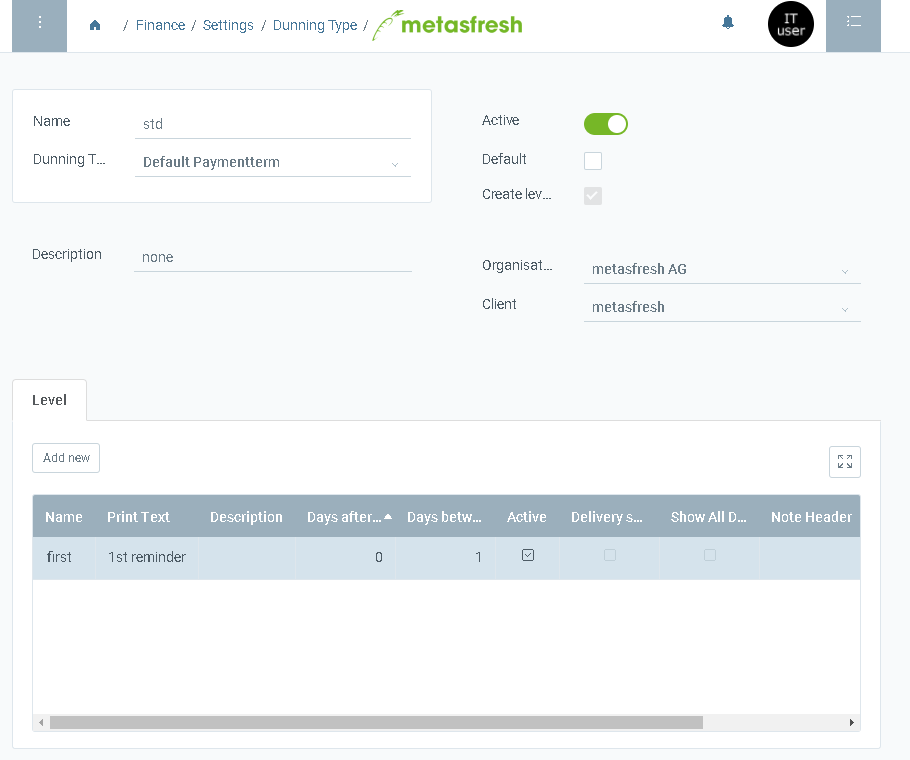
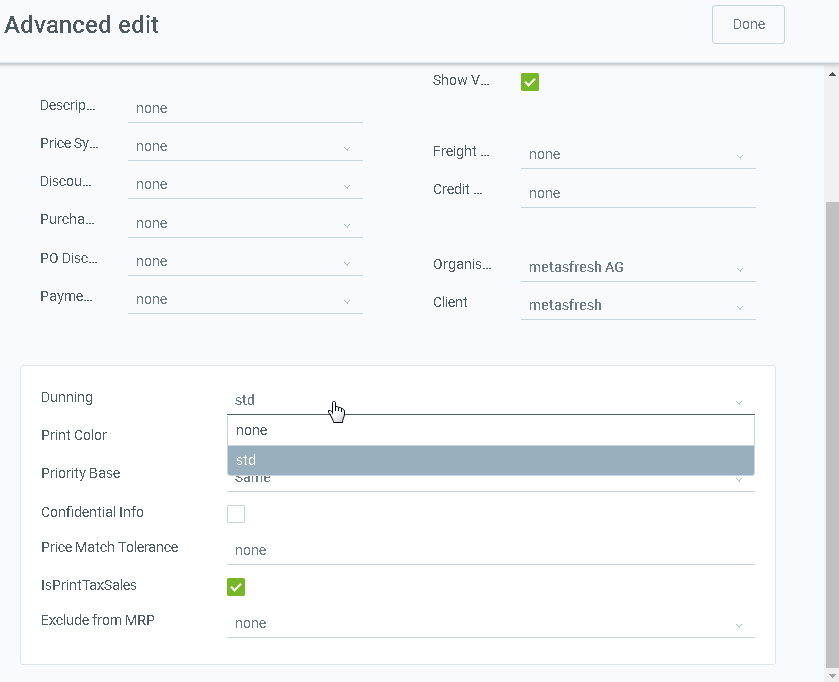
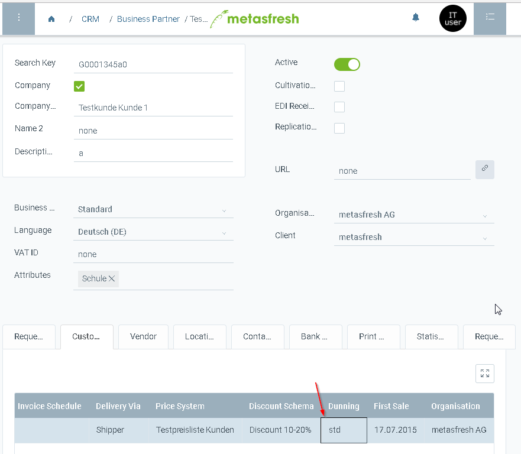

## Overview

1. configure Outbound Documents Config for table c_dunning_docs in order to have dunning Documents created in outbound documents. Make sure that exists a print format for yhat table. If not, please, select one in here.

1. define a dunning type in window "Dunning Type" with at least one step

1. link dunning type to a partner group in window "Partner Group"

or to a single customer

