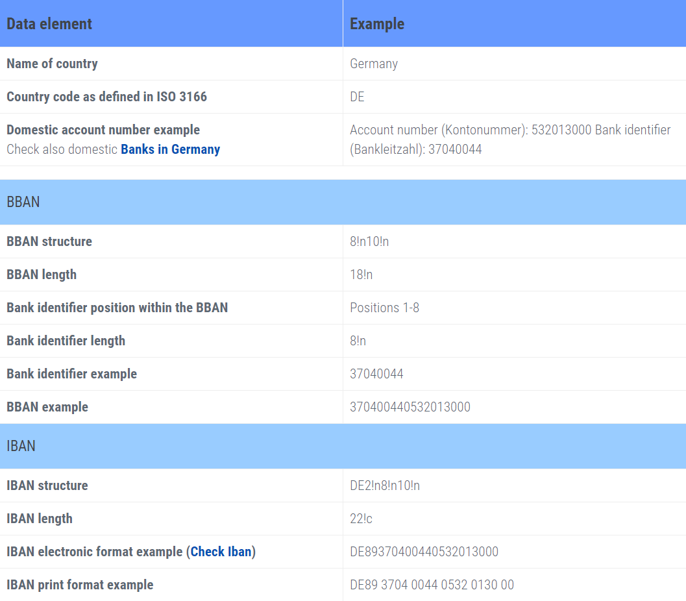

## Overview
Without previously configuring the International Bank Account Number (IBAN) structure, an IBAN cannot be recorded under "[Bank Account](Menu)" in the menu. Only after specifying the correct structure will an IBAN be validated automatically when added.

| **Note:** |
| :--- |
| For more information on IBAN and BBAN structures, please refer to the official <a href="https://www.swift.com/sites/default/files/resources/iban_registry.pdf" title="Data Standards (PDF) &#124; swift.com" target="\_blank">IBAN Registry</a> or the <a href="https://www.ecbs.org/iban.htm" title="International Bank Account Number &#124; ecbs.org" target="\_blank">European Banking Resources</a>. |

## Steps
1. [Log in to metasfresh](Login) with the [user role](NewUserRole) "System Administrator".
1. Open "Country, Region" from the [menu](Menu).
1. Open the entry of an existing country for which you want to configure the IBAN structure. [Use the filter](Filtering_function) to help you find it more quickly.
1. Open the [advanced edit menu](ViewModes#adv-edit) from the [actions menu](StartAction#actions-menu).
 >**Note:** Use shortcut `Alt` + `E` / `⌥ alt` + `E`.

1. In the field **Bank Code Length**, enter the number of characters for the bank identifier, e.g., `8`.
1. In the field **Bank Code Char Type**, enter the character representation for the bank identifier, e.g., `n` for *digits* (see example below).
1. In the field **Bank Code SeqNo**, enter the number of characters for the account number, e.g., `10`.
1. Click "Done" to apply the changes and close the advanced edit menu.
1. [metasfresh saves the progress automatically](Saveindicator).

## Example
The structure of a German bank account number:

<kbd></kbd>

(Source: <a href="https://www.ecbs.org/iban/germany-bank-account-number.html" title="European Banking Resources" target="\_blank">ecbs.org</a>)

 The IBAN structure for each country is defined using the following character representations:

| Character | Representation Type |
| :--: | :-- |
| n | Digits (numeric characters 0 to 9 only) |
| a | Uppercase letters (alphabetic characters A-Z only) |
| c | Upper- and lowercase alphanumeric characters (A-Z, a-z and 0-9) |
| e | Blank space |
| ! | Indicates a fixed length (e.g., `8!n` means 8 digits max.) |

(Source: <a href="https://www.swift.com/sites/default/files/resources/iban_registry.pdf" title="IBAN Registry (PDF)" target="\_blank">swift.com</a>)

