## Overview
In September 2025, Exchange Online permanently removed support for Basic authentication with Client Submission (SMTP AUTH). Since then, applications and devices are no longer able to use Basic auth as an authentication method and must use OAuth when using SMTP AUTH to send email. (*compare also: <a href="https://techcommunity.microsoft.com/blog/exchange/exchange-online-to-retire-basic-auth-for-client-submission-smtp-auth/4114750" title="Exchange Online to retire Basic auth for Client Submission (SMTP AUTH) &#124; techcommunity.microsoft.com" target="\_blank">MS Exchange Team Blog</a>*)

You can use the **OAuth authentication** service provided by **Microsoft Entra** to enable your metasfresh application to connect with IMAP, POP, or SMTP protocols to access Exchange Online in Office 365. (*compare also: <a href="https://learn.microsoft.com/en-us/exchange/client-developer/legacy-protocols/how-to-authenticate-an-imap-pop-smtp-application-by-using-oauth" title="Authenticate an IMAP, POP or SMTP connection using OAuth &#124; learn.microsoft.com" target="\_blank">Microsoft Learn</a>*)

In order to get **authorized access** to a user's **Outlook mail data** in a personal or organization account, you can use **Microsoft Graph**. With the appropriate delegated or application mail permissions, your app can access the mail data of the signed-in user or any user in a tenant. 
The **Microsoft Graph API** supports accessing data in users' primary mailboxes and in shared mailboxes. The data can be calendar, mail, or personal contacts stored in a mailbox in the cloud on Exchange Online as part of Microsoft 365, or on Exchange on-premises in a hybrid deployment. (*compare also: <a href="https://learn.microsoft.com/en-us/graph/api/resources/mail-api-overview?view=graph-rest-1.0" title="Use the Outlook mail REST API &#124; learn.microsoft.com" target="\_blank">Microsoft Learn</a>*)

This guide will help you obtain the **information required to connect** your metasfresh app with your Microsoft mailbox which are:
- `Client ID`
- `Tenant ID`
- `Secret Value`

In order to **set up MS Entra to integrate metasfresh ERP using the MS Graph service**, please proceed as follows:

## Steps
1. Log on to the **Microsoft Entra admin center** or sign up first for an account at <a href="https://entra.microsoft.com/" title="Microsoft Entra Login" target="\_blank">https://entra.microsoft.com/</a>.

### Register your Application
1. In your account, go to "<abbr title="Home > App registrations > Register and application">App registrations</abbr>" and click **New registration**. An overlay window opens up.

    

<small><em>Click to view screenshot</em></small>

    <kbd>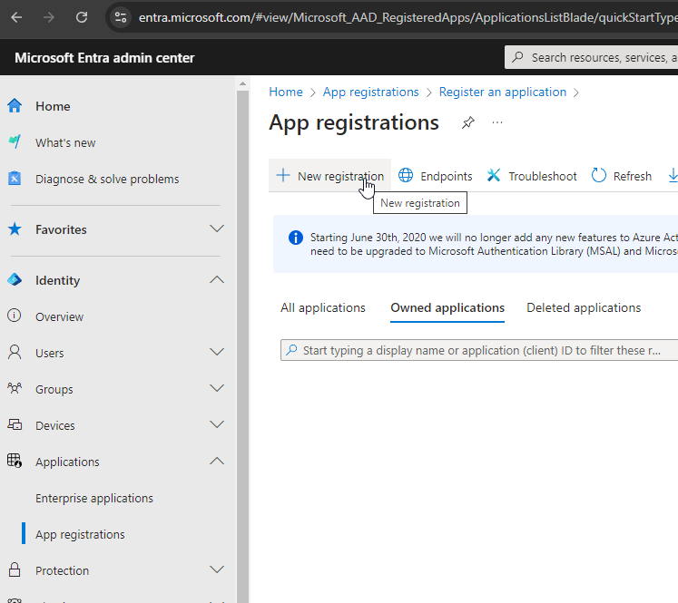</kbd>

    

1. Enter a **Name** (user-facing display name) for your application. Under **Supported account types** select the option *Accounts in any organizational directory (Any Microsoft Entra ID tenant - Multitenant)* for who can use the app or access the API.

    

<small><em>Click to view screenshot</em></small>

    <kbd>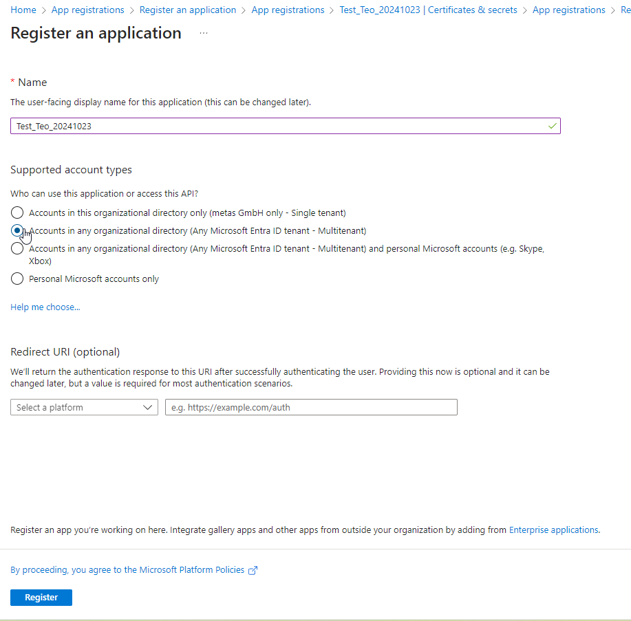</kbd>

    

1. Click  to save the app settings.
1. Go to "Overview" to see the app information such as display name, app (client) ID, directory (tenant) ID, etc.

    

<small><em>Click to view screenshot</em></small>

    <kbd>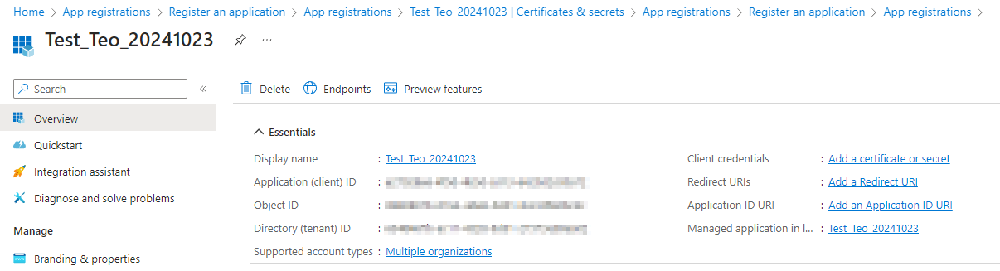</kbd>

    

### Add a Client Secret
1. Go to "Certificates & secrets" and click **New client secret**. An overlay window opens up.

    

<small><em>Click to view screenshot</em></small>

    <kbd>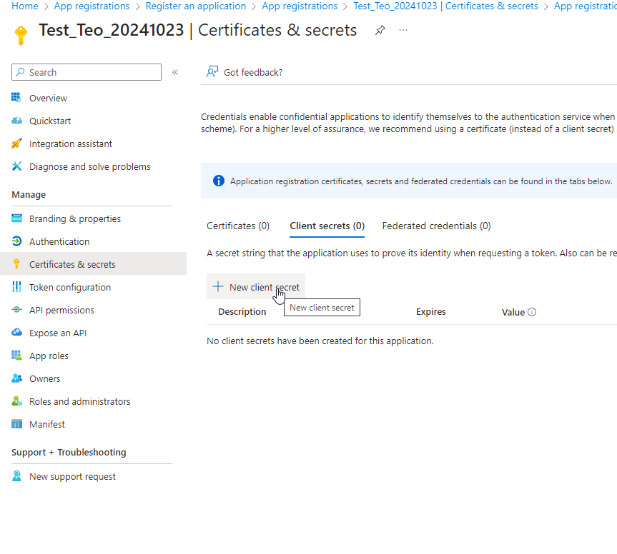</kbd>

    

1. Fill in the mandatory fields (e.g. Description, Expires, etc.)

    

<small><em>Click to view screenshot</em></small>

    <kbd>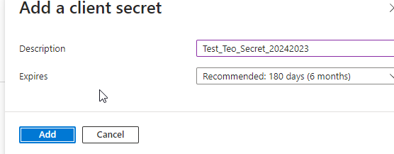</kbd>

    

    >**Note:** If you want to set a custom expiry date, keep in mind that the secret's maximum expiration time is 2 years.
    

<small><em>Click to view screenshot</em></small>

    <kbd>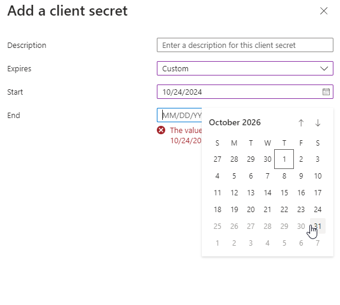</kbd>
    

| **Important note: Note down the Secret!** |
| :--- |
| Client secret values cannot be viewed, except for immediately after creation. Be sure to **save the secret when created before leaving the page**. 

<small><em>Click to view screenshot</em></small>
<kbd>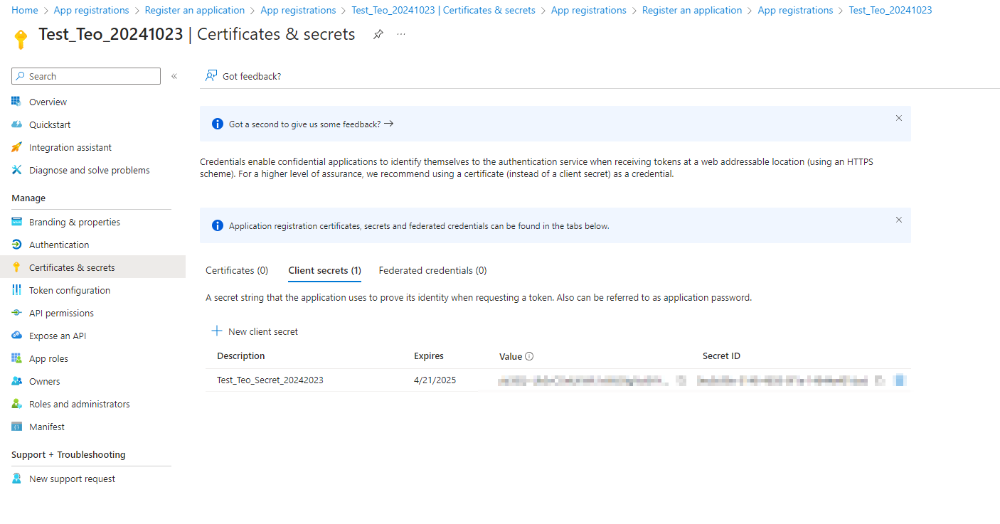</kbd>
 |

### Add API Permissions
1. Go to "API permissions" and click **Add a permission**. An overlay window "Request API permissions" opens up.

    

<small><em>Click to view screenshot</em></small>

    <kbd>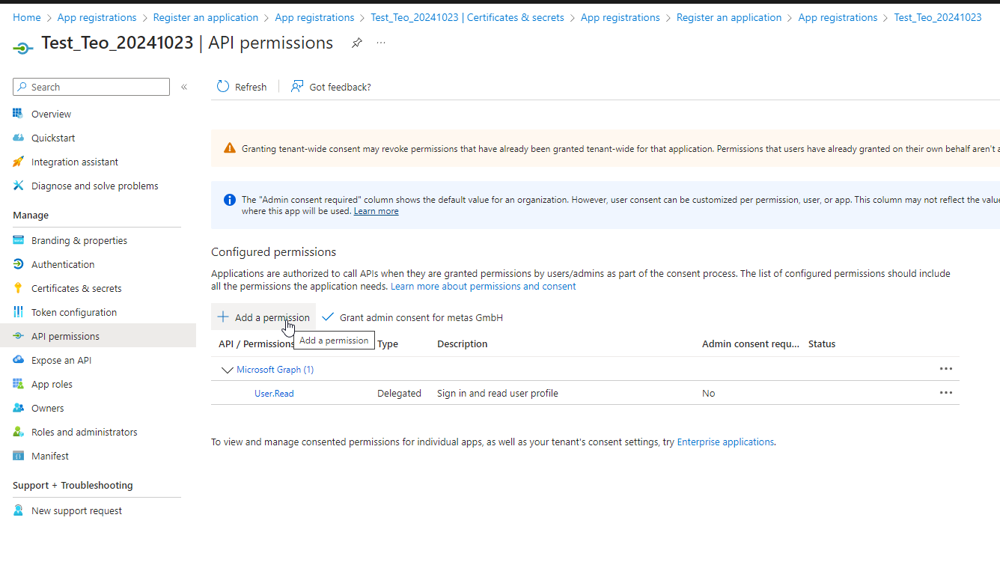</kbd>

    

1. Under "Microsoft APIs" select the option **Microsoft Graph**.

    

<small><em>Click to view screenshot</em></small>

    <kbd>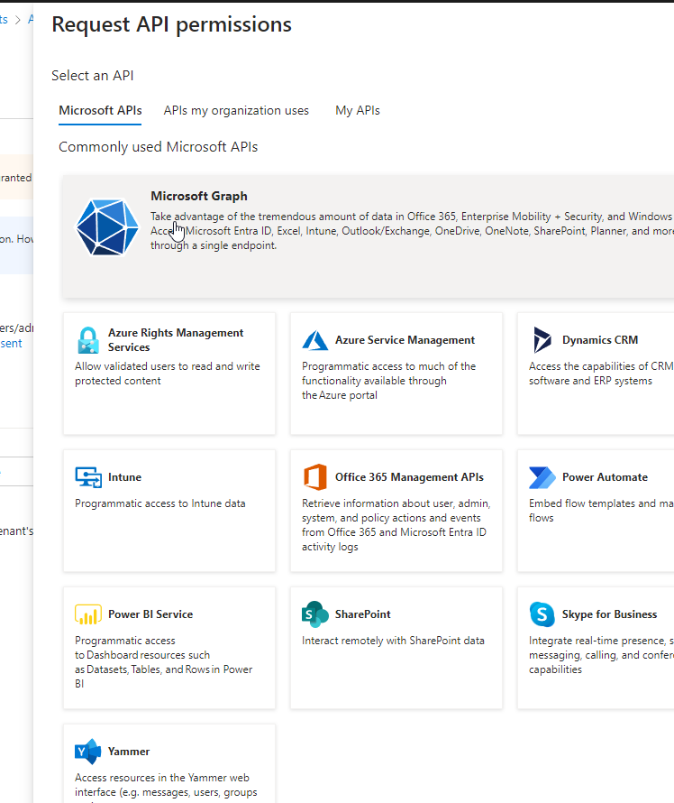</kbd>

    

1. Select the option **Application permissions** as the type of permission your app requires.

    

<small><em>Click to view screenshot</em></small>

    <kbd>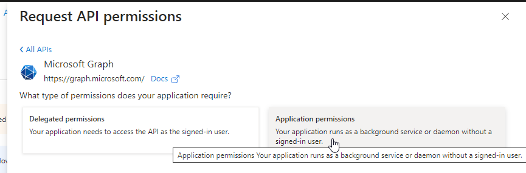</kbd>

    

1. In the search box under "Select permissions", search for `mail.send`, select the homonymous option from the results and click .

    

<small><em>Click to view screenshot</em></small>

    <kbd>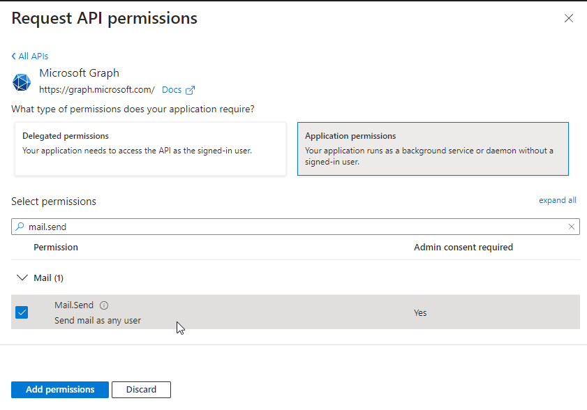</kbd>

    

#### Grant API Permissions
After adding new API permissions, you need to grant them for your organization.

<small><em>Click to view screenshot</em></small>

<kbd>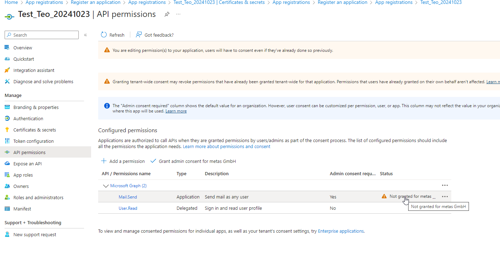</kbd>

1. Click **Grant admin consent for [your organization]**.

    

<small><em>Click to view screenshot</em></small>

    <kbd>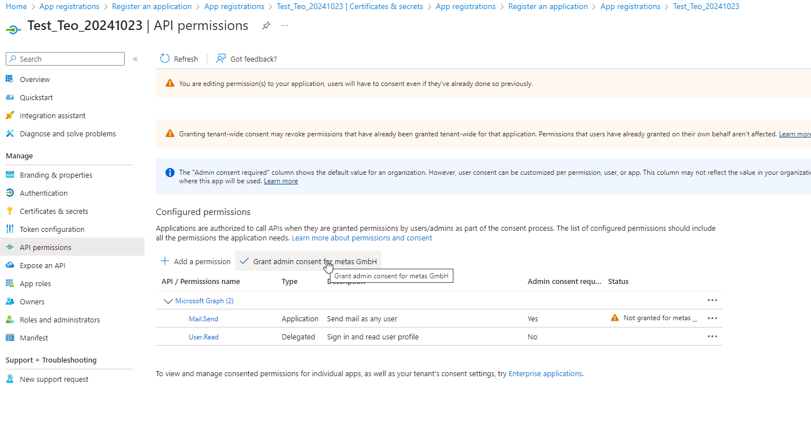</kbd>

    

1. Click `YES` in the dialog box to confirm granting admin consent.

    

<small><em>Click to view screenshot</em></small>

    <kbd>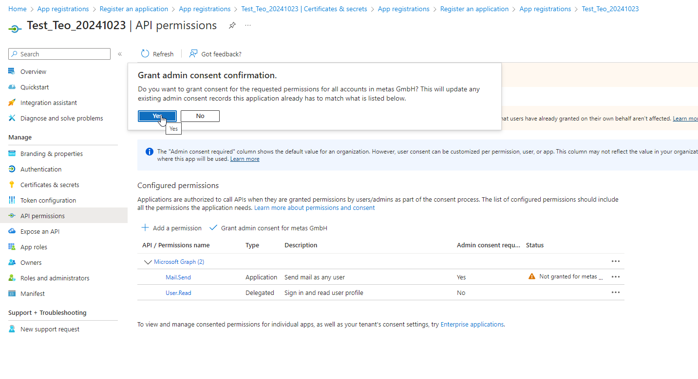</kbd>

    

1. Now you successfully granted admin consent for the requested permissions.

    

<small><em>Click to view screenshot</em></small>

    <kbd>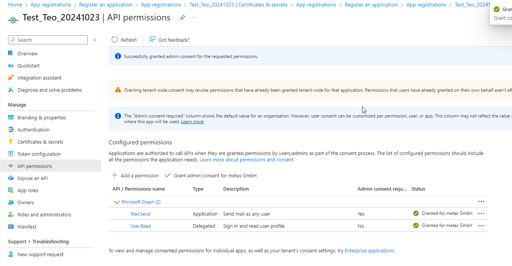</kbd>

    

### Retrieve the `Client ID` and `Tenant ID`
After successfully completing all steps described above, you will find the information required to connect your metasfresh app with your Microsoft mailbox in the **"Overview" section of the MS Entra menu**.

<small><em>Click to view screenshot</em></small>

<kbd>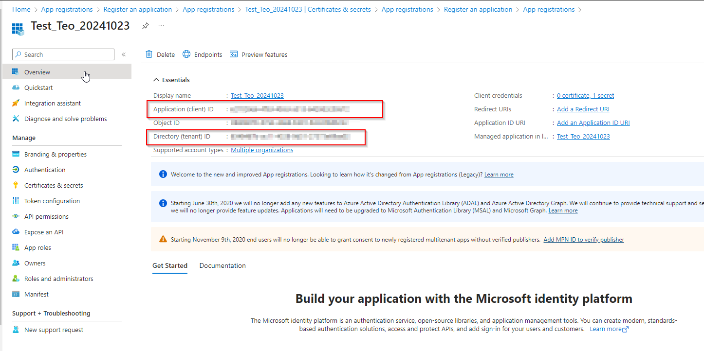</kbd>

 

| **Important note** |
| :--- |
| With the configuration above, the application has the permission to **send mail as ANY user** in the organization. To limit access to a specific user, additional configuration is required (***see "Next Steps" below***). |

## Error Messages
These error messages point out that SMTP authentication is not supported.

<kbd style="font-size:12pt; font-family:arial; line-height:1.5;">Server error 
Invalid Username/Password: 535 5.7.139 Authentication unsuccessful, SmtpClientAuthentication is disabled for the Mailbox.</kbd>  

<kbd style="font-size:12pt; font-family:arial; line-height:1.5;">Server error 
550 5.7.30 Basic authentication is not supported for Client Submission.</kbd>  

## Next Steps (optional)
- Limit email access to specific users (Microsoft Exchange Mailbox).
