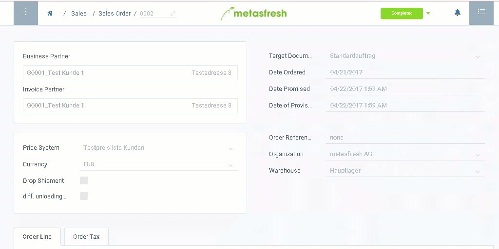

## Steps
1. Open the entry of a [completed sales order](SalesOrder_recording).
1. [Jump to](JumptoviaSidebar) "Shipment Disposition".
1. [Select the order lines](RecordSelection) you want to ship.
1. [Start the quick action](StartAction) "Generate Shipments". An overlay window opens up.
 >**Note:** You will also find this action in the actions menu in both the list view and the detailed view of an entry.

1. Click "Start" to confirm and close the overlay window.
1. You will receive a notification  in the upper right corner once the shipment is generated.
1. Click on the notification to open the delivery note.
1. [Open the PDF print preview](PrintPreview).

## Next Steps
- [Create an invoice](Invoice_SalesOrder) for the sales order.

## Example

