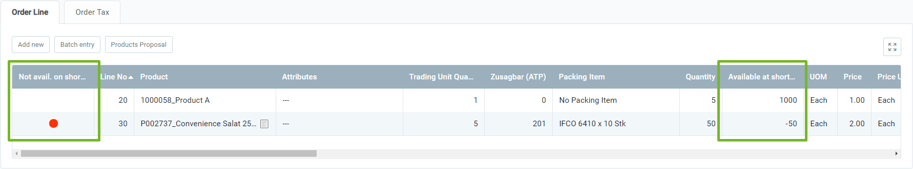

## Overview
When [entering sales order lines](SalesOrder_recording), metasfresh does not only keep an eye on the stock quantities available-to-promise (ATP) which include the currently available stock quantities as well as [incoming](CreateGoodsReceipt) and [outgoing goods](Ship_SalesOrder) (see also [material schedule](Menu)). It also monitors the *short-term availability of stocked products* by taking into account all order lines that have been previously recorded in both open and completed sales orders during a given time interval. This feature is of particular importance when multiple sales orders are recorded at the same time or at short intervals for different customers with the same product which would lead to potential complications in the supply of goods – unless metasfresh watches out for this not to happen.

You can see the short-term availability of a product in the respective order line when entering a sales order. If a product is ***not*** available on short-term, a **red** dot will be displayed in the column **Not avail. on short-term**, otherwise, the column will remain empty. The quantity available on short-term of a product in stock is provided in the column **Available at short notice**.

If a sales order with products that are not available on short-term is completed and product planning was configured appropriately, then either purchase orders or manufacturing orders will be created, depending on the [product planning configurations](Productplanning), in order to restore the stocks of the depleted products.

## System administrator configurations
As system administrator you can set the parameters under "Available quantity for sales config" in the menu that will be used by metasfresh to check the short-term availability. You can also configure different settings for various organizations. Possible parameters include:

| Parameter | Description |
| :--- | :--- |
| Look-behind interval for uncompleted sales order lines | The value contains the number of hours to look back from the current moment when searching for uncompleted sales order lines to compute the quantity available for sales. The value should be set dependent on the usual order processing time. |
| Look-ahead interval for planned shipments | The value contains the number of hours to look ahead from the provision date of the current sales order when searching for foreseeable shipments to compute the quantity available for sales. The value should be set dependent on the usual supply interval. |
| Color for short-term availability problem | Color to use for flagging sales order lines where the current stock minus foreseeable shipments is not sufficient to fulfill the ordered quantity. |
| Asynchronous request | Specifies whether availability requests are done asynchronously in the background. The respective order lines are updated as soon as the result is found. |
| Async timeout | Maximum time in milliseconds to wait for an asynchronous result before the request is aborted with an error message. |
| Organization | Organizational entity within client. |

In order to configure the short-term availability check, please proceed as follows:

## Steps
1. Open "Available quantity for sales config" from the [menu](Menu).
1. Open an existing entry or [create a new one](New_Record_Window).
1. Enter the **Look-behind interval for uncompleted sales order lines (hrs)**.
1. Enter the **Look-ahead interval for planned shipments (hrs)**.
1. Pick a **Color for short-term availability problem**.
1. ***Optional:*** Enter a **Description** into the text field provided.
1. **a)** Tick the checkbox **Asynchronous request** if you want the availability requests to be done in the background. A new field **Async timeout (ms)** appears.   **b)** Enter a value for the **Async timeout (ms)**.

1. Pick an **Organization** that these settings shall apply to.
1. [metasfresh saves the progress automatically](Saveindicator).

## Next Steps
- [Set up product planning for automatic restocking of depleted products](Productplanning).
