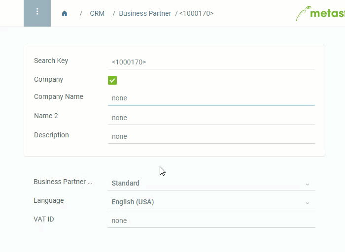

## Overview
Actions are contextual and can be started from every window. Each window therefore provides other actions.

## Steps

1. Click on  or press `Ctrl + 1` to open the action menu.
1. Click on the desired action.
 

## Example

