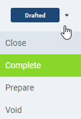

## Overview
Actions are contextual and can be started from every window. Each window therefore provides other actions. 
In metasfresh there are three different types of actions:

## Common Actions (Actions Menu)
You will find these actions in the Actions Menu.

### Steps
1. Click on  or press `Alt + 1` to open the actions menu.
1. Click on the desired action.

### Example

---

## Document Processing Actions
You will find these actions in documents, such as [Sales Orders](SalesOrder_recording), [Purchase Orders](CreatePurchaseOrder) or [Manufacturing Orders](NewManufacturingOrder). You can use them to configure the document statuses. 

### Steps
1. Click on  or press `Alt + I` to open the Document Processing Menu.
1. Click on the desired action.

---

## Quick Actions
You will find Quick Actions for processes, such as [Creating Goods Receipts](CreateGoodsReceipt), [Order Picking](Howto_use_Picking_Terminal), [Product Manufacturing](ProductionCompletion)  etc. You can identify them by the big  at the top right of the window.

### Steps
- Click on the Quick Actions Button or press `Alt + U` to execute the shown quick action.
- Click on the box next to the Quick Actions Button or press `Alt + L` to toggle the Quick Actions Menu and select an action other than the one shown.
