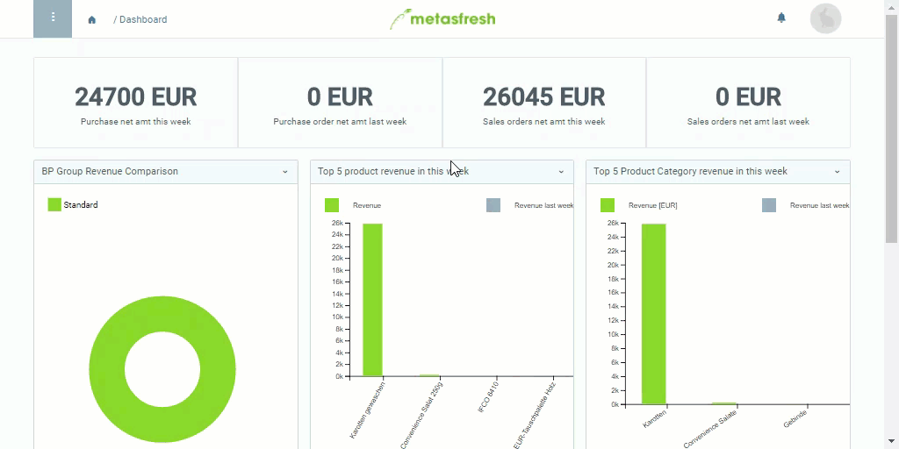

## Steps
1. Open the user menu  in the upper right corner of the menu bar.
 >**Note:** Use shortcut `Alt` + `4` / `⌥ alt` + `4`.

1. Click on "Settings" or "Einstellungen", respectively.
1. On the left side of the window, switch to another **Language**.
1. [metasfresh saves the progress automatically](Saveindicator).

## Example

