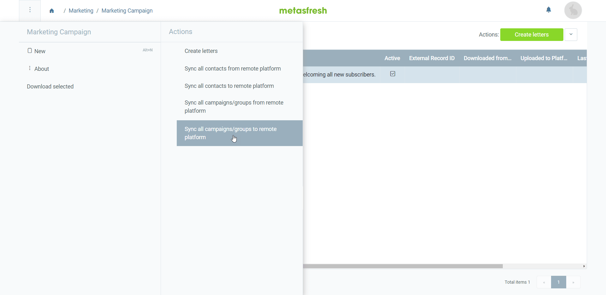

## Overview
[Marketing campaigns](Create_MKTG_campaign) can be synchronized bidirectionally (i.e. from metasfresh to the [marketing platform](Create_MKTG_platform) and vice versa), thus keeping all contact data up to date at all times and with a minimum amount of effort.

## Steps
1. Open "Marketing Campaign" from the [menu](Menu).
1. From the [list view](ViewModes#list-view), [select](RecordSelection) the [marketing campaign(s)](Create_MKTG_campaign) you want to sync with a [marketing platform](Create_MKTG_platform).
1. [Start the action](StartAction#actions-menu) of your choice:
   - "Sync all campaigns/groups from remote platform",
   - "Sync all campaigns/groups to remote platform",
   - "Sync all contacts from remote platform",
   - "Sync all contacts to remote platform". 

   An overlay window opens up.

1. Enter a part of the [**Marketing Platform**](Create_MKTG_platform) to/from which you want to sync the data and click on the matching result in the <a href="Keyboard_shortcuts_reference#dropdown" title="Dynamic Search Box (Autocompletion)">drop-down list</a>.
1. Click "Start" to begin data synchronization and close the overlay window.
1. [metasfresh saves the progress automatically](Saveindicator).

## Example
<kbd></kbd>
