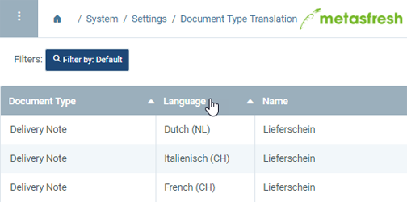
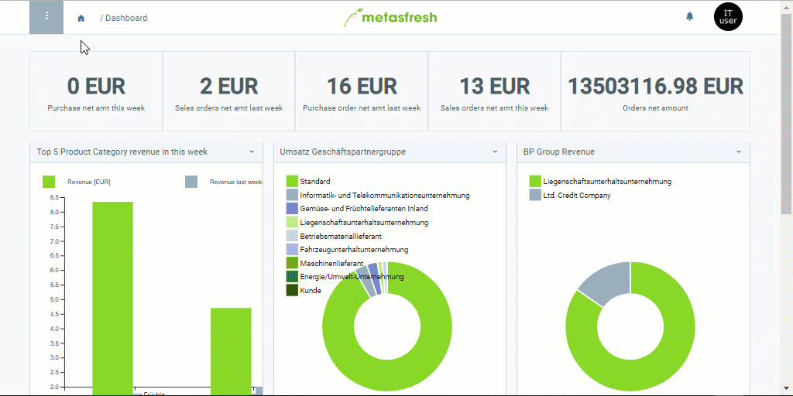

## Overview
In metasfresh you can [record manual texts](Print_text_on_documents-doctype) for every document type (e.g. bill of lading, incoming invoice, purchase order, sales order, quotation, etc.) and autonomously transfer these texts into your business partners’ languages so that when you [print commercial documents](PrintPreview) for foreign business partners, the texts will automatically appear in their respective languages on these documents.

## Steps

### Open the translation entry

#### a) Via the navigation menu
1. Open "Document Type Translation" from the [menu](Menu).
1. [Use the filter](Filtering_function) to find the entry for which you want to add a foreign language text version. There is one entry for each available language (see column **Language**).

 

#### b) Jumping from the entry via the sidebar
If you are already looking at the document type for which you want to add a foreign language text version, you can take the following steps:

1. Use the entry's [related documents to jump](JumptoviaSidebar) into the window "Document Type Translation" (under SYSTEM in the sidebar).
1. In this window you will see all translation entries for the selected entry.

### Add text versions in foreign languages
1. Open the entry of the language in which you want to write the text, e.g. "Deutsch (CH)".
1. In the text box **Document Note** enter the foreign language text version that you want to appear at the bottom of the document.
1. In the text box **Description** enter the foreign language text version that you want to appear at the top of the document.
1. [metasfresh saves the progress automatically](Saveindicator).

## Example

