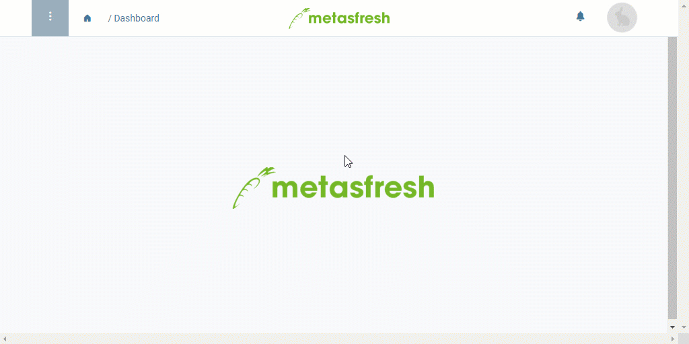

## Steps
1. Open "Balance" from the [menu](Menu). An overlay window opens up.
1. Choose a **Date** for which you want to create a trial balance.
1. Click "Start" to create the balance and close the overlay window.
1. A PDF file opens up showing the trial balance and you can save it to your device.

## Example

