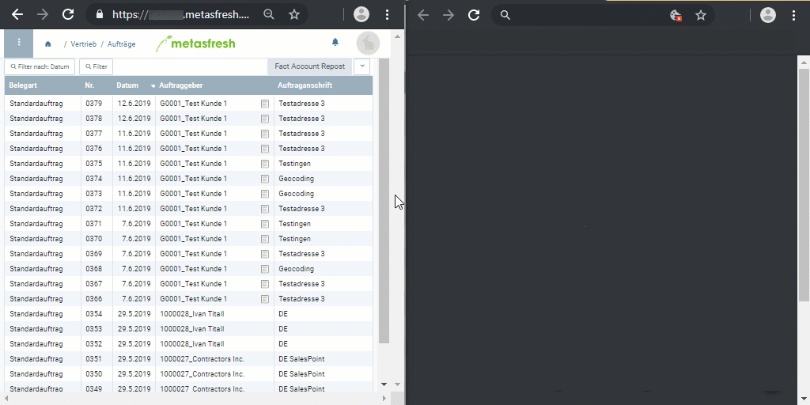

## Overview
In metasfresh, each window and document has its own unique URL or hyperlink that you can share with colleagues in other locations so they can see exactly the same content as you, provided they have the same [user rights](NewUserRole).

For example, in a window in [list view](ViewModes#list-view) you can [filter](Filtering_function) a table by date, copy the resulting hyperlink from your browser's address bar and email it to a specific person who can then open that link in their browser to view your filter result.

Plus, there is [metasfresh's real-time window update feature](Real-time_feature)!

### Unique Window URLs

