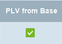

## Overview
In metasfresh, you can assign a general base price list to various customer-specific [price lists](Add_price-list). With just a click of the mouse, this base price list can be used to update the [product prices](Add_price) (i.e. create new [price list versions](Add_price-list-version)) of all customer price lists linked to or derived from the base price list through the application of pricing conditions defined in a [price list schema](Add_price_list_schema).

## Requirements
1. [Create a general price list](Add_price-list) that can be set as *base price list* in customer-specific price lists.
1. [Create customer-specific price lists](Add_price-list) and link them to the **base price list**.
1. The (derivative) customer price lists must be [marked as "sales price list"](Add_price-list) and be [linked to a customer](Assign_prices_to_partner).
1. For this customer, updating price list versions derived from base price list versions must be enabled.
 >**Note:** To enable this, tick the checkbox **PLV from Base** in the customer line of the record tab "Customer" of the customer entry under "[Business Partner](Menu)" in the menu.  

## Steps

### Update base price list version
1. Open "Price List" from the [menu](Menu).
1. Open the entry of the *general* price list that is used as base price list in customer-specific price lists.
1. [Add a new (current) price list version](Add_price-list-version) that serves as the basis for recalculating the product prices of all derivable price lists and set a [**price list schema**](Add_price_list_schema) in which the desired pricing conditions are defined.
 >**Note:** This price list version does not have to contain any product prices. Only its **Valid from** date is relevant for naming the new customer-specific price list versions and setting their **Valid from** date.

### Update derivative price lists
1. Go to the record tab "Price List Version" at the bottom of the page and [select](RecordSelection) the line of the new base price list version.
1. [Start the action](StartAction) "Apply to derivative price lists". An overlay window opens up.
1. Click "Start" to close the overlay window and, according to the base price list schema, update all customer-specific price lists that are linked to the general base price list.
