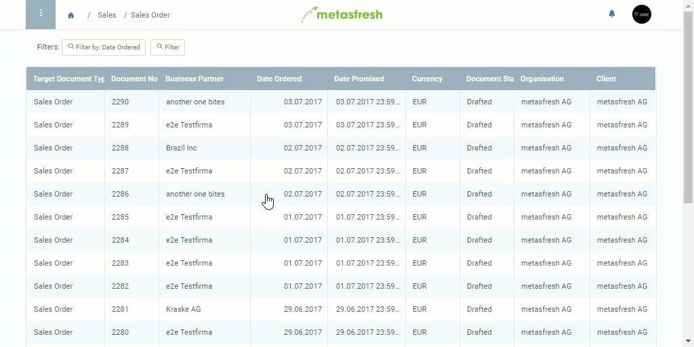
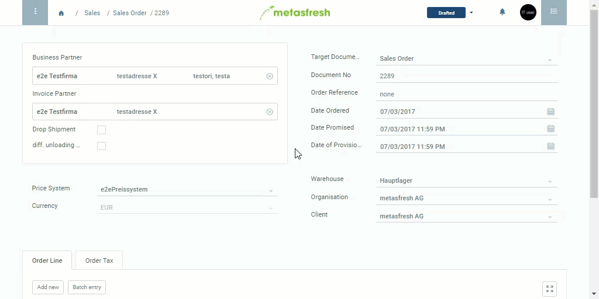

## List view
In general, all windows (e.g. "Sales Order") open up in list view. No edits can be done here, only filtering and sorting of records.

## Detailed view
When you double-click a record or [create a new record](New_Record_Window), metasfresh automatically switches to the detailed view. Here you can edit your record.

To switch back to the list view, simply go to the Navigation Menu and click on the previous link. Alternatively you can also use the back button of your web browser.

See here how to switch between detailed view and list view:

## Advanced Edit
The detailed view only shows the main fields. To see and edit all additional fields, go to the [action menu](StartAction) and click on "Advanced Edit".
 > Note: Use shortcut `Ctrl + E` to open the Advanced Edit window.

See here how to switch from the detailed view into the Advanced Edit view:

